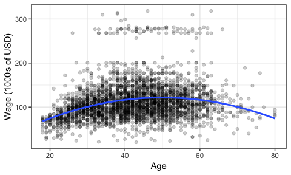
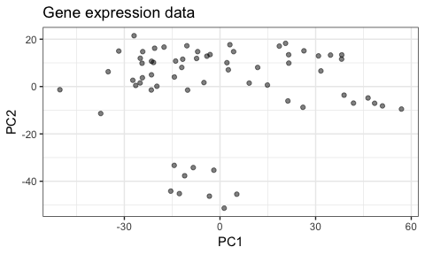
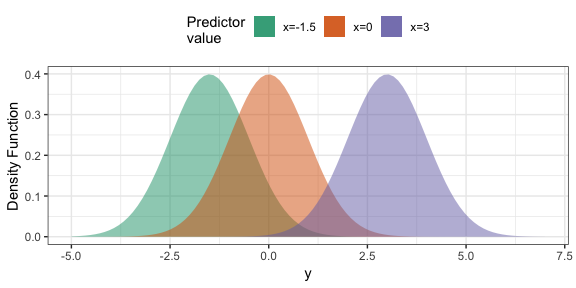
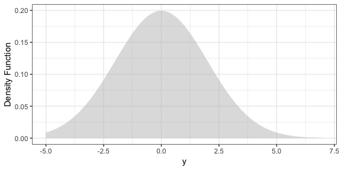
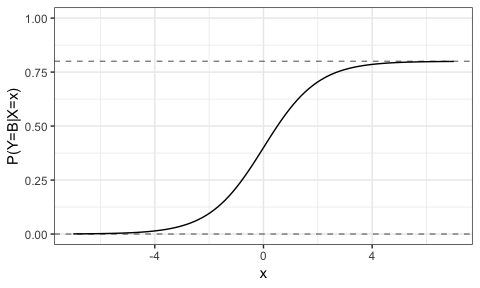

# Overview

In today's class, we'll discuss:

- Discussions: asking effective questions, and intro to your participation assessment
- What machine learning is, beginning with the concept of irreducible error. 

# About

## About me

A data scientist and teaching fellow at UBC for the Master of Data Science program. My background:

- BSc Biology (Brock U)
- BSc Mathematics (Brock U)
- MSc Mathematical Statistics (Brock U)
- PhD Statistics (UBC)
    - Thesis on forecasting extremes for flooding via multivariate dependence modelling.

Computationally, I am primarily an R programmer. I'm a basic python user.

Lots of experience as a statistical consultant for business and academia. 

# R and python

1. If you haven't already, install R and RStudio.
    - RStudio is the editor we'll be using to code in R. You can use something else if you want, but I highly recommend not.
2. Install R packages by running these commands in the console (these are used at least for this manuscript -- we'll encounter more throughout the course).
    - `install.packages("tidyverse")` -- a suite of useful packages for data science.
    - `install.packages("ISLR")` -- the package to accompany the ISLR book.
    - `install.packages("knitr")`


# Asking effective questions

It's an art to ask a question online _effectively_. The idea is to make things as easy as possible for someone to answer. Make it self-contained; don't make someone have to do unnecessary digging to answer the question:

- Provide relevant links (for example, to the relevant assignment or course notes).
- Make a reproducible example (in the case that it's a question involving code).
	- Sometimes called a [Minimal Working Example](https://en.wikipedia.org/wiki/Minimal_working_example) (MWE).
- Be detailed.

You'll probably find that the act of writing an effective question causes you to answer your own question! In this case, post your question anyway, with the corresponding solution. 

I recommend checking out the [STAT545 "how to get unstuck" page](http://stat545.com/help-general.html) for resources on how to get your questions answered. 

## Your Turn

For this exercise, you'll be commenting on the quality of some online questions/discussions.

1. Find a question/issue or two that someone has posed online. Ideally, one should also have a response. See below for some example sites.
2. Add a comment to the thread in canvas. For each question you examined, specify:
    - A link to the thread/question
    - In what ways is the question/issue worded effectively/ineffectively? Why? What would make it better, if anything?
    - If there is a discussion surrounding this question/issue, did any comments add value to the discussion? Were any supportive? Were any destructive? How so?

We'll talk about some examples after you're done. Here are some sites you might find useful:

- [`scipy` GitHub Issues](https://github.com/scipy/scipy/issues) (a popular python package)
- [`ggplot2` GitHub Issues](https://github.com/tidyverse/ggplot2/issues) (a popular R package)
- [Stack Overflow](https://stackoverflow.com/)

# Introduction to Machine Learning

In this section, we'll go over some basic machine learning concepts.

- Prediction quantity: mean and mode.
- Error measurements
- What is irreducible error?

## What machine learning is

What is Machine Learning (ML) (or Statistical Learning)? As the [ISLR book](http://www-bcf.usc.edu/~gareth/ISL/) puts it, it's a "vast set of tools for understanding data". Before we explain more, we need to consider the two main types of ML:

- __Supervised learning__. (_This is the focus of BAIT 509_). Consider a "black box" that accepts some input(s), and returns some type of output. Feed it a variety of input, and write down the output each time (to obtain a _data set_). _Supervised learning_ attempts to learn from these data to re-construct this black box. That is, it's a way of building a forecaster/prediction tool. 

You've already seen examples throughout MBAN. For example, consider trying to predict someone's wage (output) based on their age (input). Using the `Wage` data set from the `ISLR` R package, here are examples of inputs and outputs:


 age        wage
----  ----------
  18    75.04315
  24    70.47602
  45   130.98218
  43   154.68529
  50    75.04315
  54   127.11574

We try to model the relationship between age and wage so that we can predict the salary of a new individual, given their age. 

An example supervised learning technique is _linear regression_, which you've seen before in BABS 507/508. For an age `x`, let's use linear regression to make a prediction that's quadratic in `x`. Here's the fit:



The blue curve represents our attempt to "re-construct" the black box by learning from the existing data. So, for a new individual aged 70, we would predict a salary of about \$100,000. A 50-year-old, about \$125,000.


- __Unsupervised learning__. (_BAIT 509 will not focus on this_). Sometimes we can't see the output of the black box. _Unsupervised learning_ attempts to find structure in the data without any output. 

For example, consider the following two gene expression measurements (actually two principal components). Are there groups that we can identify here?



You've seen methods for doing this in BABS 507/508, such as k-means. 


## Variable terminology

In supervised learning:

- The output is a random variable, typically denoted $Y$. 
- The input(s) variables (which may or may not be random), if there are $p$ of them, are typically denoted $X_1$, ..., $X_p$ -- or just $X$ if there's one. 

There are many names for the input and output variables. Here are some (there are more, undoubtedly):

- __Output__: response, dependent variable. 
- __Input__: predictors, covariates, features, independent variables, explanatory variables, regressors. 

In BAIT 509, we will use the terminology _predictors_ and _response_.

## Variable types

Terminology surrounding variable types can be confusing, so it's worth going over it. Here are some non-technical definitions. 

- A __numeric__ variable is one that has a quantity associated with it, such as age or height. Of these, a numeric variable can be one of two things:
- A __categorical__ variable, as the name suggests, is a variable that can be one of many categories. For example, type of fruit; success or failure.  

## Types of Supervised Learning

There are two main types of supervised learning methods -- determined entirely by the type of response variable.

- __Regression__ is supervised learning when the response is numeric.
- __Classification__ is supervised learning when the response is categorical. 

We'll examine both equally in this course. 

Note: Don't confuse classification with _clustering_! The latter is an unsupervised learning method.

## What have you heard of so far?

Let's write down some supervised learning techniques that you've heard of. Are there any that you particularly are interested in learning about?

## Together: Linear Regression Example

Let's predict _Sepal Width_ of iris species using the `iris` data set.

1. Univariate example.
	1. Pick a prediction.
	2. "Calculate" prediction for a new iris plant.
	3. Evaluate error on the data
2. Using species.
	1. Use species as a predictor.
	2. Calculate prediction for a new _setosa_ plant.
	3. Evaluate error on the data. How does it compare to the univariate example?
3. Try using all other recorded features.

# Irreducible Error

The concept of __irreducible error__ is paramount to supervised learning. Next time, we'll look at the concept of _reducible_ error. 

When building a supervised learning model (like linear regression), we can never build a perfect forecaster -- even if we have infinite data!

Let's explore this notion. When we hypothetically have an infinite amount of data to train a model with, what we actually have is the _probability distribution_ of $Y$ given any value of the predictors. The uncertainty in this probability distribution is the __irreducible error__.

__Example__: Let's say $(X,Y)$ follows a (known) bivariate Normal distribution. Then, for any input of $X$, $Y$ has a _distribution_. Here are some examples of this distribution for a few values of the predictor variable (these are called _conditional_ distributions, because they're conditional on observing particular values of the predictors).



This means we cannot know what $Y$ will be, no matter what! What's one to do?

- In __regression__ (i.e., when $Y$ is numeric, as above), the go-to standard is to predict the _mean_ as our best guess. 
    - We typically measure error with the __mean squared error__ = average of (observed-predicted)^2. 
- In __classification__, the conditional distributions are categorical variables, so the go-to standard is to predict the _mode_ as our best guess (i.e., the category having the highest probability). 
    - A typical measurement of error is the __error rate__ = proportion of incorrect predictions.
    - A more "complete" picture of error is the __entropy__, or equivalently, the __information measure__. 

In Class Meeting 07, we'll look at different options besides the mean and the mode.

An important concept is that _predictors give us more information about the response_, leading to a more certain distribution. In the above example, let's try to make a prediction when we don't have knowledge of predictors. Here's what the distribution of the response looks like:



This is much more uncertain than in the case where we have predictors!

# In-class Exercises: Irreducible Error

## Oracle regression

Suppose you have two independent predictors, $X_1, X_2 \sim N(0,1)$, and the conditional distribution of $Y$ is
$$ Y \mid (X_1=x_1, X_2=x_2) \sim N(5-x_1+2x_2, 1). $$
From this, it follows that:

- The conditional distribution of $Y$ given _only_ $X_1$ is
$$ Y \mid X_1=x_1 \sim N(5-x_1, 5). $$
- The conditional distribution of $Y$ given _only_ $X_2$ is
$$ Y \mid X_2=x_2 \sim N(5+2x_2, 2). $$
- The (marginal) distribution of $Y$ (not given any of the predictors) is
$$ Y \sim N(5, 6). $$

The following R function generates data from the joint distribution of $(X_1, X_2, Y)$. It takes a single positive integer as an input, representing the sample size, and returns a `tibble` (a fancy version of a data frame) with columns named `x1`, `x2`, and `y`, corresponding to the random vector $(X_1, X_2, Y)$, with realizations given in the rows. 

```
genreg <- function(n){
    x1 <- rnorm(n)
    x2 <- rnorm(n)
    eps <- rnorm(n)
    y <- 5-x1+2*x2+eps
    tibble(x1=x1, x2=x2, y=y)
}
```


1. Generate data -- as much as you'd like.

```
dat <- genreg(1000)
```


2. For now, ignore the $Y$ values. Use the means from the distributions listed above to predict $Y$ under four circumstances:
    1. Using both the values of $X_1$ and $X_2$.
    2. Using only the values of $X_1$.
    3. Using only the values of $X_2$.
    4. Using neither the values of $X_1$ nor $X_2$. (Your predictions in this case will be the same every time -- what is that number?)
    
```
dat <- mutate(dat,
       yhat = FILL_THIS_IN,
       yhat1 = FILL_THIS_IN,
       yhat2 = FILL_THIS_IN,
       yhat12 = FILL_THIS_IN)
```
    

3. Now use the actual outcomes of $Y$ to calculate the mean squared error (MSE) for each of the four situations. 
    - Try re-running the simulation with a new batch of data. Do your MSE's change much? If so, choose a larger sample so that these numbers are more stable.
    
```
(mse <- mean((dat$FILL_THIS_IN - dat$y)^2))
(mse1 <- mean((dat$FILL_THIS_IN - dat$y)^2))
(mse2 <- mean((dat$FILL_THIS_IN - dat$y)^2))
(mse12 <- mean((dat$FILL_THIS_IN - dat$y)^2))
knitr::kable(tribble(
    ~ Case, ~ MSE,
    "No predictors", mse,
    "Only X1", mse1,
    "Only X2", mse2,
    "Both X1 and X2", mse12
))
```

    
4. Order the situations from "best forecaster" to "worst forecaster". Why do we see this order?


## Oracle classification

Consider a categorical response that can take on one of three categories: _A_, _B_, or _C_. The conditional probabilities are:
$$ P(Y=A \mid X=x) = 0.2, $$
$$ P(Y=B \mid X=x) = 0.8/(1+e^{-x}), $$

To help you visualize this, here is a plot of $P(Y=B \mid X=x)$ vs $x$ (notice that it is bounded above by 0.8, and below by 0).


```r
ggplot(tibble(x=c(-7, 7)), aes(x)) +
    stat_function(fun=function(x) 0.8/(1+exp(-x))) +
    ylim(c(0,1)) +
    geom_hline(yintercept=c(0,0.8), linetype="dashed", alpha=0.5) +
    theme_bw() +
    labs(y="P(Y=B|X=x)")
```



Here's an R function to generate data for you, where $X\sim N(0,1)$. As before, it accepts a positive integer as its input, representing the sample size, and returns a tibble with column names `x` and `y` corresponding to the predictor and response. 

```
gencla <- function(n) {
    x <- rnorm(n) 
    pB <- 0.8/(1+exp(-x))
    y <- map_chr(pB, function(t) 
            sample(LETTERS[1:3], size=1, replace=TRUE,
                   prob=c(0.2, t, 1-t-0.2)))
    tibble(x=x, y=y)
}
```


1. Calculate the probabilities of each category when $X=1$. What about when $X=-2$? With this information, what would you classify $Y$ as in both cases?
    - BONUS: Plot these two conditional distributions. 

```
## X=1:
(pB <- FILL_THIS_IN)
(pA <- FILL_THIS_IN)
(pC <- FILL_THIS_IN)
ggplot(tibble(p=c(pA,pB,pC), y=LETTERS[1:3]), aes(y, p)) +
    geom_col() +
    theme_bw() +
    labs(y="Probabilities", title="X=1")
## X=-2
(pB <- FILL_THIS_IN)
(pA <- FILL_THIS_IN)
(pC <- FILL_THIS_IN)
ggplot(tibble(p=c(pA,pB,pC), y=LETTERS[1:3]), aes(y, p)) +
    geom_col() +
    theme_bw() +
    labs("Probabilities", title="X=-2")
```

2. In general, when would you classify $Y$ as _A_? _B_? _C_?

## (BONUS) Random prediction

You might think that, if we know the conditional distribution of $Y$ given some predictors, why not take a random draw from that distribution as our prediction? After all, this would be simulating nature.

The problem is, this prediction doesn't do well. 

Re-do the regression exercise above (feel free to only do Case 1 to prove the point), but this time, instead of using the mean as a prediction, use a random draw from the conditional distributions. Calculate the MSE. How much worse is it? How does this error compare to the original Case 1-4 errors?

## (BONUS) A more non-standard regression

The regression example given above is your perfect, everything-is-linear-and-Normal world. Let's see an example of a joint distribution of $(X,Y)$ that's _not_ Normal. 

The joint distribution in question can be respresented as follows:
$$ Y|X=x \sim \text{Beta}(e^{-x}, 1/x), $$
$$ X \sim \text{Exp}(1). $$

Write a formula that gives a prediction of $Y$ from $X$ (you might have to look up the formula for the mean of a Beta random variable). Generate data, and evaluate the MSE. Plot the data, and the conditional mean as a function of $x$ overtop. 

## (BONUS) Oracle MSE

What statistical quantity does the mean squared error (MSE) reduce to when we know the true distribution of the data? Hint: if each conditional distribution has a certain variance, what then is the MSE?

What is the error rate in the classification setting?
