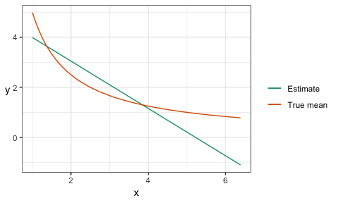
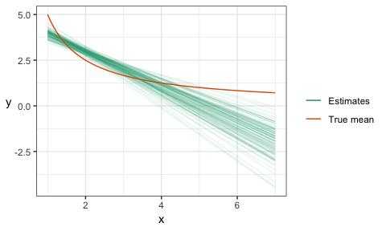
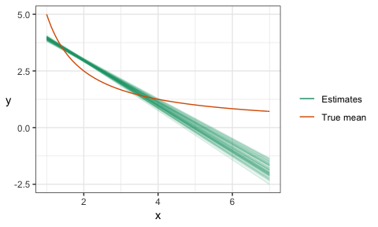
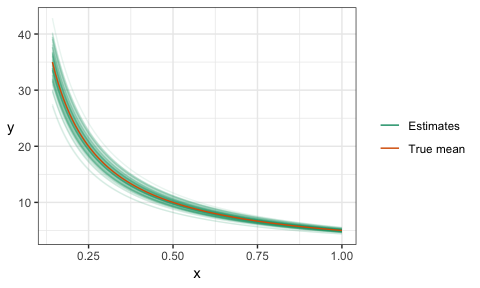

# Outline

- Classification example
- Generalization error
- Optimize the _reducible error_ through the fundamental tradeoff.

# Classification Exercise: Do Together

Let's use the `Default` data in the `ISLR` R package for classification: predict whether or not a new individual will default on their credit card debt.

Our task: make the best prediction model we can.

1. Code the null model.
	- What would you predict for a new person?
	- What's the error using the original data (aka training data)?
2. Plot all the data, and come up with a classifier by eye.
	- What would you predict for a non-student with income $40,000 and balance $1,011?
	- Classify the original (training) data. What's the overall error?
3. How might we optimize the classifier? Let's code it.

Discussion: does it make sense to classify a new iris plant species based on the `iris` dataset?

# Training Error vs. Generalization Error

Discussion: 

1. What's wrong with calculating error on the training data? 
2. What's an alternative way to compute error?

Activity: Get the generalization error for the above classifier.

# Model complexity

A big part of machine learning is choosing how complex to make a model. Examples:

- More partitions in the above credit card default classifier
- Adding higher order polynomials in linear regression

And lots more that we'll see when we explore more machine learning models.

__The difficulty__: adding more complexity will decrease training error. What's a way of dealing with this?

## Activity

Let's return to the `iris` example from lecture 1, predicting Sepal Width, this time using Petal Width only, using polynomial linear regression.

__Task__: Choose an optimal polynomial order.

Here's code for a graph to visualize the model fit:

```
p <- 4
ggplot(iris, aes(Petal.Width, Sepal.Width)) +
	geom_point(alpha = 0.2) +
	geom_smooth(method = "lm", formula = y ~ poly(x, p)) +
	theme_bw()
```


# Reducible Error

## What is it?

Last time, we saw what irreducible error is, and how to "beat" it. 

The other type of error is __reducible error__, which arises from not knowing the true distribution of the data (or some aspect of it, such as the mean or mode). We therefore have to _estimate_ this. Error in this estimation is known as the reducible error. 

## Example

- one numeric predictor
- one numeric response
- true (unknown) distribution of the data is $Y|X=x \sim N(5/x, 1)$ (and take $X \sim 1+Exp(1)$). 
- you only see the following 100 observations stored in `dat`, plotted below, and choose to use linear regression as a model:



The difference between the true curve and the estimated curve is due to reducible error. 

In the classification setting, a misidentification of the mode is due to reducible error. 

(__Why the toy data set instead of real ones?__ Because I can embed characteristics into the data for pedagogical reasons. You'll see real data at least in the assignments and final project.)

## Bias and Variance

There are two key aspects to reducible error: __bias__ and __variance__. They only make sense in light of the hypothetical situation of building a model/forecaster over and over again as we generate a new data set over and over again.

- __Bias__ occurs when your estimates are systematically different from the truth. For regression, this means that the estimated mean is either usually bigger or usually smaller than the true mean. For a classifier, it's the systematic tendency to choosing an incorrect mode.
- __Variance__ refers to the variability of your estimates.

There is usually (always?) a tradeoff between bias and variance. It's referred to as the __bias/variance tradeoff__, and we'll see examples of this later.  

Let's look at the above linear regression example again. I'll generate 100 data sets, and fit a linear regression for each:



The _spread_ of the linear regression estimates is the variance; the difference between the _center of the regression lines_ and the true mean curve is the bias. 

## Reducing reducible error

As the name suggests, we can reduce reducible error. Exactly how depends on the machine learning method, but in general:

- We can reduce variance by increasing the sample size, and adding more model assumptions.
- We can reduce bias by being less strict with model assumptions, OR by specifying them to be closer to the truth (which we never know).

Consider the above regression example again. Notice how my estimates tighten up when they're based on a larger sample size (1000 here, instead of 100):



Notice how, after fitting the linear regression $E(Y|X=x)=\beta_0 + \beta_1 (1/x)$ (which is a _correct_ model assumption), the regression estimates are centered around the truth -- that is, they are unbiased:




## Error decomposition

We saw that we measure error using mean squared error (MSE) in the case of regression, and the error rate in the case of a classifier. These both contain all errors: irreducible error, bias, and variance:

MSE = bias^2 + variance + irreducible variance

A similar decomposition for error rate exists.

__Note__: If you look online, the MSE is often defined as the expected squared difference between a parameter and its estimate, in which case the "irreducible error" is not present. We're taking MSE to be the expected squared distance between a true "new" observation and our prediction (mean estimate). 
