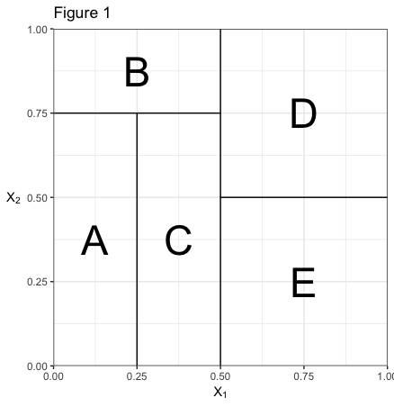
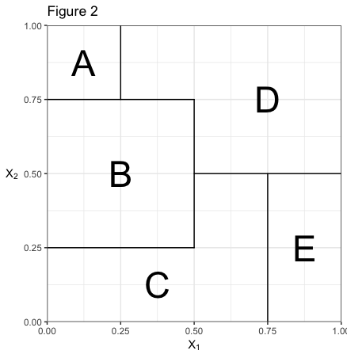
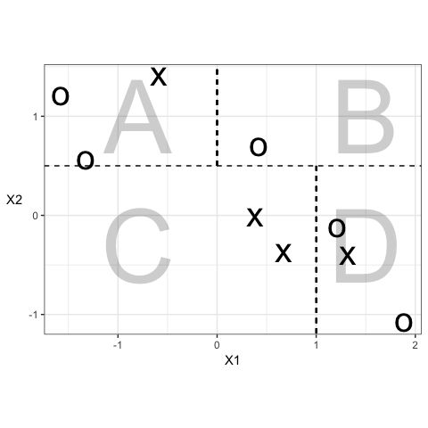

# BAIT 509 Assignment 2

__Evaluates__: Class meetings 05 and 07 (not 06, which is specific to your final project).

__Due__: Wednesday, March 21 at 10:00am (i.e., the start of Class Meeting 07).

## Instructions (5%)

- You must use proper spelling and grammar.
- Use either R or python to complete this assignment (or both). 
- Submit your assignment through [UBC Connect](https://connect.ubc.ca/) by the deadline. 
- If you submit more than one file for your assignment, be sure to also include a README file to inform the grader of how to navigate your solutions.

## Exercise 1: Concepts (25%)

Respond to the following questions, without using code. When asked to explain/write, there's no need for a lengthy explanation! We're looking for big-picture concepts here, that can be conveyed in 1-3 short sentences. 

### 1.1

Explain, in two or three brief sentences, what bagging is and why it is useful.

### 1.2

Consider the two-predictor case (say $X_1$ and $X_2$). Which of the following partitions of the predictor space correspond to a tree -- Figure 1 or Figure 2? If the letters represent the decisions in each case, write out the decision tree for this partition.

### 1.3

In random forests, how do we ensure that the trees being averaged are sufficiently different from each other as to make the averaging effective?

### 1.4

Consider the following partition of the (two-predictor) predictor space. This time, the letters are there for you to refer to label the four regions. The response is categorical, and can either be "x" or "o". 

(a) For this regression tree, what predictions would be made for each of the regions A through D?
(b) What is the classification error for this decision?

### 1.5

Why might we not want a decision tree to split until the training data are perfectly classified? What aspect of a decision tree can we control to prevent creating a decision tree that large?

## Exercise 2 (70%)

Answer questions 7 and 8 in Section 8.4 of the [ISLR](http://www-bcf.usc.edu/~gareth/ISL/) book (pages 333-334). 

Although the intent is for you to use R, you can use python if you wish:

- The documentation for the scikit-learn implementation of the decision tree classifier is at http://scikit-learn.org/stable/modules/generated/sklearn.tree.DecisionTreeClassifier.html
