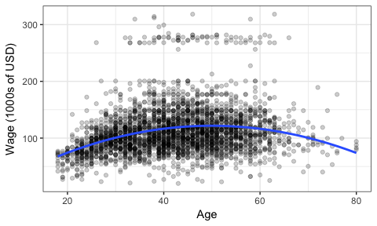
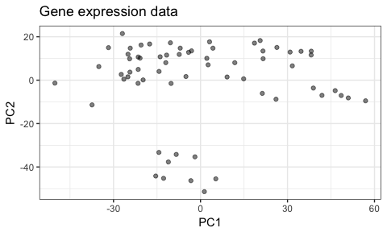

BAIT 509 Class Meeting 01
================

Overview
--------

First listening component:

-   About me; about you; about the course.
-   Online discussions
-   GitHub

In-class Exercise:

-   Getting acquainted with GitHub
-   Online discussions

Second listening component:

-   More tools for data science, and the course

Lab:

-   Basics of Machine Learning
-   Fill out survey
-   git

About
-----

### About me

A data scientist and teaching fellow at UBC for the Master of Data Science program. My background:

-   BSc Biology (Brock U)
-   BSc Mathematics (Brock U)
-   MSc Mathematical Statistics (Brock U)
-   PhD Statistics (UBC)
    -   Thesis on forecasting extremes for flooding via multivariate dependence modelling.

Computationally, I am primarily an R programmer.

Lots of experience as a statistical consultant for business and academia.

### About you

Introduce yourself! Let's hear about:

-   Your name
-   Why MBAN?
-   Something about yourself.

### About this course

This is a brand new course! You can expect things to evolve as we progress.

-   Preview of the course website -- it contains all materials related to the course.
-   Preview of the syllabus

Before we talk more about the assessments, let's first talk about the structure of our class meetings.

### About class meetings

I intend most class meetings to take the **listen-do-listen-do** form:

1.  **Listen**: (15 min?) I'll start class meetings with high-level explanations of a topic.
2.  **Do**: (40 min?) You do hands-on exploratory work to allow you to build concepts.
    -   You "present" your work to initiate a class discussion; I clarify concepts as needed.
3.  **Listen**: (25 min?) Once you have basic concepts down pat, I'll talk more about details.
4.  **Do**: (40 min?) Open time for working on course material, typically assignments or in-class material. Instructor and a TA will be present to answer questions.

Notes:

-   This structure might evolve as the course progresses.
-   There will be a TA present to help you.
-   In-class exercises will typically contain toy data sets; assignments will be more "real".

### About class meeting notes

(This manuscript being one of them!)

Each class meeting will be accompanied with a manuscript of notes to guide the meeting. I intend these to generally be structured as:

-   Outline
-   Basic concepts
-   In-class exercises
-   More advanced concepts

Participation Skills
--------------------

### Your participation assessment

Let's go over how you'll be assessed. See the `participation` file in the `assignments` folder.

### Online discussion

By now, you're used to asking questions and contributing to discussions *in class*. But the world of *online discussions* is quite different.

You are encouraged to ask questions online via [GitHub issues on the BAIT509 repo](https://github.com/vincenzocoia/BAIT509/issues). Feel free to ask about anything related to the course, including (but not limited to):

-   content
-   assessments
-   coding
-   jobs
-   requests

You are also encouraged to interact with these Issues:

-   Add a comment to the Issue if you have something to add; or propose a solution to their question.
-   Add to the question.
-   Give the question a "thumbs up" if you have this same question and like the way it was worded.
-   Ask for more details.

Think for a moment why I'm including this in your *class notes* instead of in the document outlining our expectations for your `participation`. When you interact like this outside of the BAIT509 repo, you become a valuable contributor to the data science community in general! For example, you would do these things if you experience a (legitimate) problem with an R package. See the [`ggplot2` Issues](https://github.com/tidyverse/ggplot2/issues) as an example; or, if an R package does not have a GitHub repo, you can contact the author directly.

### Asking effective questions

It's an art to ask a question online *effectively*. The idea is to make things as easy as possible for someone to answer. Make it self-contained; don't make someone have to do unnecessary digging to answer the question:

-   Provide relevant links (for example, to the relevant assignment or course notes).
-   Make a reproducible example (in the case that it's a question involving code).
-   Be detailed.

You'll probably find that the act of writing an effective question causes you to answer your own question! In this case, post your question anyway, with the corresponding solution.

Note that the BAIT 509 GitHub issues are **public** -- anyone with internet can view them. This is a good thing -- it is a display of your thoughtfulness, your willingness to participate, and your willingness to ask questions.

On that note, don't be afraid to ask a question here! Discrimination and ridicule will not be tolerated, and this includes on the BAIT509 repo. The teaching team will provide guidance on a per-question basis, and students are also encouraged to provide ways in which a question can be made more effective.

Here are some resources to help you get a sense of how to ask a question online:

-   I recommend checking out [these guidelines](http://stat545.com/help-STAT545.html#github-issue) used in STAT 545 for asking questions with GitHub issues.
-   

Git and GitHub
--------------

We'll be using git with GitHub for course materials, including a place to put your work on the in-class exercises.

**git**: A version control program. It keeps track of file changes.

**GitHub**: A service to host your files, and integrates with `git`.

We'll come back to `git` later, but for now, let's focus on GitHub.

You might find these readings helpful:

-   I recommend reading ["Why Git? Why GitHub?"](http://happygitwithr.com/big-picture.html) by Jenny Bryan if you're not familiar with what these tools are all about, and why they are useful for data science. It's an incomplete chapter in an incomplete book, but still very useful.
-   [This STAT 545 lesson](http://stat545.com/cm003-notes_and_exercises.html) aims to introduce git and GitHub.

In-Class Exercises
------------------

For your first exercise, you'll first acquaint yourself with GitHub, then add a comment on the BAIT509 Issue about effective questions. Here are your instructions.

**Note**: Done early? Head to the "Lab" section of these course notes for additional tasks!

### Acquaint yourself with GitHub and the BAIT 509 repo

1.  **Make an account**: If you haven't already, make an account on [github.com](https://github.com/).
    -   Jenny's ["Register a GitHub account"](http://happygitwithr.com/github-acct.html) chapter is useful if you want to read more.
2.  **Fill out the survey**: Let us know your github.com username by filling in the survey at <https://goo.gl/forms/uEy5UpHAmCZiOIh42>
3.  **Watch BAIT509**: Navigate to the [BAIT509 github page](https://github.com/vincenzocoia/BAIT509), and click "Watch" -&gt; "Watching" (in the upper-right corner of the page).
    -   This will notify you by email whenever a new issue comment is made. We'll be using issues for remote discussion about course material and assignments.
4.  **Set up your own BAIT509 repo** (repo="repository"): You'll use this repo to put your in-class work, and notes. You can do this in one of two ways:
    1.  Maintain your own copy of the main BAIT 509 repo (\***recommended**\*), by [`Fork`ing](https://help.github.com/articles/fork-a-repo/) the main BAIT509 repo.
        -   There's a button for this at the top-right corner of the main BAIT 509 repo page.
        -   This is useful so you can [keep your fork synced](https://help.github.com/articles/fork-a-repo/#keep-your-fork-synced) as the main repo evolves throughout the course -- more on this later.
    2.  Start fresh and create a new blank repo.
5.  **Add to your repo**: On your new BAIT 509 repo, add a new folder for you to put your in-class exercises, seeded with a README file. To do this for a folder called `my_folder`:
    1.  Click "Create New File" on the main repo page.
    2.  In the file name, type `my_folder/README.md`. Populate the contents with a brief description of what this folder will be used for (a one-liner is fine).
    3.  Click "Commit new file".
6.  **Education Account**: Your new repository is by default **public**/open to the world. I recommend you keep it this way. If you have time, and are interested in making the repository private without having to pay, try [requesting an Education account](https://education.github.com/).
    -   *If you do make your repo private*, you'll need to [add the teaching team as collaborators](https://help.github.com/articles/inviting-collaborators-to-a-personal-repository/) to your repo so that we can evaluate your participation. See the course [README](../README.md) for our github usernames.

### Evaluating questions

For this exercise, I'll make an Issue on the BAIT509 repo soliciting your comments regarding the quality of some online questions/discussions.

1.  Find a question/issue or two that someone has posed online. Ideally, one should also have a response. See below for some example sites.
2.  Add a comment to the BAIT509 Issue. For each thread you examined, specify:
    -   A link to the thread/question
    -   In what ways is the question/issue worded effectively/ineffectively? Why? What would make it better, if anything?
        -   Note that people often reply with this type of feedback, too! Sometimes not in a pleasant way, unfortunately.
    -   If there is a discussion surrounding this question/issue, did any comments add value to the discussion? Were any supportive? Were any destructive? How so?

We'll talk about some examples after you're done. Here are some sites you might find useful:

-   [`ggplot2` GitHub Issues](https://github.com/tidyverse/ggplot2/issues) (a popular R package)
-   [`scipy` GitHub Issues](https://github.com/scipy/scipy/issues) (a popular python package)
-   [Stack Overflow](https://stackoverflow.com/)

Introduction to Machine Learning
--------------------------------

What is Machine Learning (ML) (or Statistical Learning)? As the [ISLR book](http://www-bcf.usc.edu/~gareth/ISL/) puts it, it's a "vast set of tools for understanding data". Before we explain more, we need to consider the two main types of ML:

-   **Supervised learning**. (*This is the focus of BAIT 509*). Consider a "black box" that accepts some input(s), and returns some type of output. Feed it a variety of input, and write down the output each time (to obtain a *data set*). *Supervised learning* attempts to learn from these data to re-construct this black box. That is, it's a way of building a forecaster/prediction tool.

For example, consider trying to predict someone's wage (output) based on their age (input). Using the `Wage` data set from the `ISLR` R package, here are examples of inputs and outputs:

|  age|       wage|
|----:|----------:|
|   18|   75.04315|
|   24|   70.47602|
|   45|  130.98218|
|   43|  154.68529|
|   50|   75.04315|
|   54|  127.11574|

We try to model the relationship between age and wage so that we can predict the salary of a new individual, given their age.

An example supervised learning technique is *linear regression*, which you've seen before in BABS 507/508. For an age `x`, let's use linear regression to make a prediction that's quadratic in `x`. Here's the fit:

The blue curve represents our attempt to "re-construct" the black box by learning from the existing data. So, for a new individual aged 70, we would predict a salary of about $100,000. A 50-year-old, about $125,000.

-   **Unsupervised learning**. (*BAIT 509 will not focus on this*). Sometimes we can't see the output of the black box. *Unsupervised learning* attempts to find structure in the data without any output.

For example, consider the following two gene expression measurements (actually two principal components). Are there groups that we can identify here?

You've seen methods for doing this in BABS 507/508, such as k-means.

Terminology
-----------

In supervised learning, we try to gain information on a variable *Y*, given observations on variables *X*1, …, *X**p*.

The variable *Y* is called the **response variable**, and sometimes the *dependent variable*.

The variables *X*1, …, *X**p* are called **predictor variables** (or just "predictors"). There are many other terms for these, including *features*, *independent variables*, and *covariates*.

Fundamental Concept: Predictors give us more information about the response
---------------------------------------------------------------------------

### Numeric Example

Take the example where (*X*, *Y*) are bivariate normal; *Y* is also Normal. Using the distribution of *Y* alone, there is a lot of uncertainty as to what a future outcome of the response might be. But if we observe, say, *X* = 2, then the distribution of *Y* is more certain. This is the **conditional distribution** of the response given the predictors.

Almost all supervised learning methods decide to use the **mean** as the prediction.

### Categorical Example

Take the example where *Y* can be one of three categories: *A*, *B*, or *C*.

DGP:

logit(*P*(*Y* = *B*|*X* = *x*)) = 5 + *x*

logit(*P*(*Y* = *C*|*X* = *x*)) = *x*

*X* is Exponential(1).

Show the marginal of Y. Show some conditional distributions.

Almost all supervised learning methods decide to use the **mode** as the prediction.

Fundamental Concept: Evaluating Prediction Goodness
---------------------------------------------------

Suppose we've come up with a model that makes predictions of the response, given knowledge of predictors. How can we evaulate how good (or bad) the predictions are? It depends on whether the response is categorical or numeric.

### Categorical Response

When the response is *categorical*, the **prediction accuracy** measures prediction "goodness" as the proportion of correct predictions:
$$ \\text{Prediction Accuracy} = \\frac{\\text{Number of correct predictions}}{\\text{Total number of predictions}}. $$
 Equivalently, we can measure the prediction "badness" with the **error rate**, which is one minus the prediction accuracy, telling us the proportion of *incorrect* predictions.

This will be the main focus of the course, but there are others, too. A common measure of goodness is the (Shannon) **information** (the equivalent measure of badness is **entropy**). These measurements consider the entire conditional distribution, as opposed to just the mode.

### Numeric Response

When the response is *numeric*, and we're forming predictions using a mean estimate (usually the case), then there are a few measures of goodness. Suppose we've made *N* predictions $\\hat{y}\_1, \\ldots, \\hat{y}\_N$, for which the actual response ended up being *y*1, …, *y**N*.

-   The **mean squared error** (MSE) is a universal measure of badness (the larger this number, the worse the model is).
    $$ \\text{MSE} = \\frac{1}{n}\\sum\_{i=1}^n (y\_i - \\hat{y}\_i)^2. $$
-   The **coefficient of determination** (*R*2) is a universal measure of goodness.
-   The **likelihood** is a measure of goodness, and is only applicable when we've made distributional assumptions.

There are extensions to these, such as AIC and adjusted *R*2, but these have a different meaning. We'll touch on these later.

Lab
---

Be sure to let us know what your github username is by [filling out the survey](https://goo.gl/forms/uEy5UpHAmCZiOIh42), if you haven't already!

### Git Exercises (end of class)

You'll need to [install `git`](http://happygitwithr.com/install-git.html) on your computers. Then [introduce yourself to `git`](http://happygitwithr.com/hello-git.html), and if you want, [install a `git` client](http://happygitwithr.com/git-client.html) (I like to use [sourcetree](https://www.sourcetreeapp.com/)).

### Adding work to your repo

### ML

-   Give an exercise with discrete and continuous *Y* with no predictors. Then introduce a categorical predictor. Then a continuous predictor (but without the categorical).
