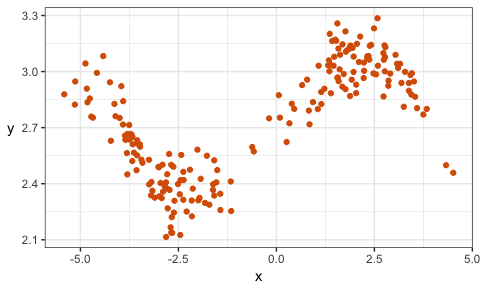

BAIT 509 Class Meeting 02: Local Classification and Regression
================

**Note**: Before the start of class, if you've `Fork`ed the main BAIT 509 repo, it's a good idea to update this fork with the newest changes made to the repo. But not critical if this sounds too crazy at this point!

0. Learning Goals
-----------------

-   Loess and kNN

In-Class Exercise
-----------------

Consider the following data set, given by `dat`. Here's the top six rows of data:

``` r
set.seed(87)
dat <- tibble(x = c(rnorm(100), rnorm(100)+5)-3,
              y = sin(x^2/5)/x + rnorm(200)/10 + exp(1))
kable(head(dat))
```

|          x|         y|
|----------:|---------:|
|  -5.142691|  2.823462|
|  -4.722812|  2.759020|
|  -4.871821|  3.043214|
|  -3.915033|  2.716712|
|  -1.164387|  2.412004|
|  -3.104414|  2.325320|

Here's a scatterplot of the data:

``` r
ggplot(dat, aes(x,y)) + 
    geom_point(colour=my_accent) +
    theme_bw() + 
    rotate_y
```



-   **Why the toy data set?** Because I can embed characteristics into the data for pedagogical reasons. You'll see real data in the assignments and final project.

Exercise 1
----------

### 1a: Mean at *X* = 0

Consider estimating the mean of *Y* when *X* = 0 by using data whose *X* values are near 0.

1.  Eyeball the above scatterplot of the data. What would you say is a reasonable estimate of the mean of *Y* at *X* = 0? Why?
2.  Estimate using two different methods:
    1.  Subset the data to the *k* nearest data points (you choose *k*), and take the average *Y*. Hints for doing this:
        -   First, add a new column in the data that stores the *distance* between *X* = 0 and each observation. If that column is named `d`, you can do this with the following partial code: `dat$d <- YOUR_CALCULATION_HERE`. Recall that `dat$x` is a vector of the `x` column.
        -   Then, arrange the data from smallest distance to largest with `arrange(dat)` (you'll need to load the `tidyverse` package first), and subset *that* to the first *k* rows.
    2.  Subset the data whose *X* values are within *r* units of 0 (you choose *r*), and take the average *Y*. Hint:
        -   Subset the data using the `filter` function. The condition to filter on: you want to keep rows whose distances (`d`) are ...

*k* and *r* are called **hyperparameters**. Method 1 is a special case of **loess** (short for "local regression"), sometimes called a **moving window**. Method 2 is called ***k*-Nearest Neighbours Regression**.

1.  What happens when you try to pick an *r* that is way too small? Say, *r* = 0.01? Why?
2.  There's a tradeoff between choosing large and small values of either hyperparameter. What's good and what's bad about choosing a large value? What about small values?

### 1b: Regression Curve

Instead of estimating the mean just at *X* = 0, we'd like to do the same procedure, but for "all" *X* values, keeping the hyperparameter fixed. Because we can't actually do this for all *X* values, let's choose a grid of 1000 *X* values between -5 and 4.

**Questions for discussion**:

-   Go ahead and do the estimation using both methods, and plot all 1000 mean estimates on top of the scatterplot in a different colour, to form a **regression curve**. Better yet, make this an actual curve by drawing a line through all 1000 estimates.
-   Play with different values of *k* and *r*. What effect does increasing these values have on the regression curve? What about decreasing? What would you say is a "good" choice of *k* and *r*, and why?
-   What happens when you choose *k* = *n* = 200? What happens if you choose *r* = 10 or bigger?

Concept of Model Assumptions
----------------------------

The model assumptions for loess are that the regression curve can be any smooth function.

An important concept in machine learning is how model assumptions influence the bias-variance tradeoff. We'll explore this throughout the course.

### Exercise

Consider
*Y* = *X* + *ε*,
 where *X* (predictor) is N(0,1), and *ε* (error term) is also N(0,1) (both are independent).

Generate a sample of size 100, 100 times. For each sample, fit a linear and local regression. Plot all 100 smoothers in one panel, and all 100 regression lines in another panel, over a grid of *x* values between -4 and 4. Be sure to include the true mean curve.

Compare the fit of the linear vs. local methods. In particular, comment on the following:

-   Where on the plot does the smoother fit worse, and why? Is this phenomenon seen in the linear model too?
-   Compare the linear and smoothed methods in terms of bias and variance. Which method is best here (if any)?

**Hints:**

-   Use alpha transparency in your plot.
-   Don't vary the smoothing parameter.
