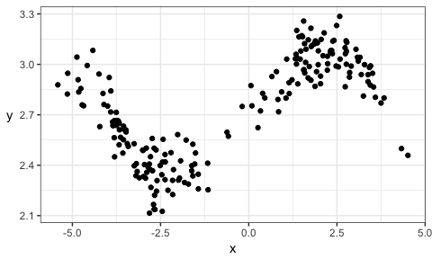

BAIT 509 Class Meeting 02: Local Classification and Regression
================

0. Learning Goals
-----------------

-   Loess and kNN

LAB PORTION
-----------

``` r
set.seed(87)
dat <- tibble(x = c(rnorm(100), rnorm(100)+5)-3,
              y = sin(x^2/5)/x + rnorm(200)/10 + exp(1))
ggplot(dat, aes(x,y)) + 
    geom_point() +
    theme_bw() + 
    rotate_y
```



Exercise 1
----------

### 1a: Mean at *X* = 0

Consider estimating the mean of *Y* when *X* = 0 by using data whose *X* values are near 0. In particular, consider two methods:

1.  use the *k* nearest data points (you choose *k*);
2.  use all data whose *X* values are within *r* units of 0 (you choose *r*).

*k* and *r* are called **hyperparameters**.

**Questions for discussion**:

-   Eyeball the plot. What would you say is a reasonable estimate of the mean of *Y* at *X* = 0? Why?
-   Pick values of *k* and *r*, and estimate the mean using both methods. Use your guess as a reference to choose a "good" value.
-   What happens when you try to pick an *r* that is way too small? Say, *r* = 0.01? Why?
-   There's a tradeoff between choosing large and small values of either hyperparameter. What's good and what's bad about choosing a large value? What about small values?

### 1b: Regression Curve

Instead of estimating the mean just at *X* = 0, we'd like to do the same procedure, but for "all" *X* values, keeping the hyperparameter fixed. Because we can't actually do this for all *X* values, let's choose a grid of 1000 *X* values between -5 and 4.

**Questions for discussion**:

-   Go ahead and do the estimation using both methods, and plot all 1000 mean estimates on top of the scatterplot in a different colour, to form a **regression curve**. Better yet, make this an actual curve by drawing a line through all 1000 estimates.
-   Play with different values of *k* and *r*. What effect does increasing these values have on the regression curve? What about decreasing? What would you say is a "good" choice of *k* and *r*, and why?
-   What happens when you choose *k* = *n* = 200? What happens if you choose *r* = 10 or bigger?
