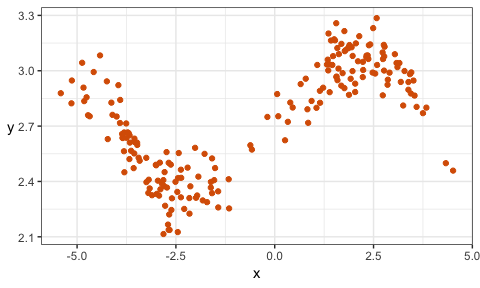
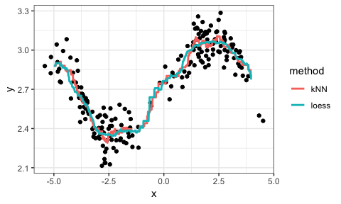
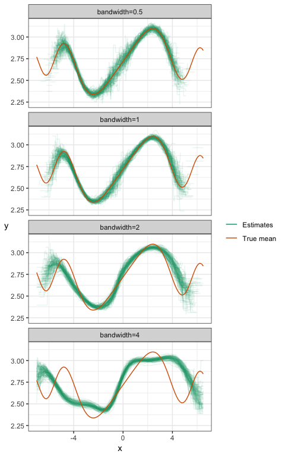
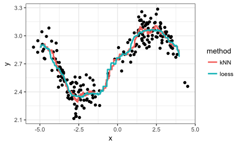

# BAIT 509 Class Meeting 03
Monday, March 5, 2018  


# Outline

- Loess and kNN

# Local machine learning methods

Let's turn our attention to the first "new" machine learning methods of the course: $k$ __Nearest Neighbours__ (aka kNN or $k$-NN) and __loess__ (aka "LOcal regrESSion").

The fundamental idea behind these methods is to _base your prediction on what happened in similar cases in the past_.

## kNN

Pick a positive integer $k$. 

To make a prediction of the response at a particular observation of the predictors (I'll call this the __query point__) -- that is, when $X_1=x_1$, ..., $X_p=x_p$:

1. Subset your data to $k$ observations (rows) whose values of the predictors $(X_1, \ldots, X_p)$ are closest to $(x_1,\ldots,x_p)$.
2. For kNN classificiation, use the "most popular vote" (i.e., the modal category) of the subsetted observations. For kNN regression, use the average $Y$ of the remaining subsetted observations.

Recall how to calculate distance between two vectors $(a_1, \ldots, a_p)$ and $(b_1, \ldots, b_p)$:
$$ \text{distance} = \sqrt{(a_1-b_1)^2 + \cdots + (a_p-b_p)^2}. $$
It's even easier when there's one predictor: it's just the absolute value of the difference. 

## loess

(This is actually the simplest version of loess, sometimes called a __moving window__ approach. We'll get to the "full" loess).

Pick a positive number $r$ (not necessarily integer). 

To make a prediction of the response at a query point (that is, a particular observation of the predictors, $X_1=x_1$, ..., $X_p=x_p$):

1. Subset your data to those observations (rows) having values of the predictors $(X_1,\ldots,X_p)$ within $r$ units of $(x_1,\ldots,x_p)$.
2. For kNN classificiation, use the "most popular vote" (i.e., the modal category) of the subsetted observations. For kNN regression, use the average $Y$ of the remaining subsetted observations.

Notice that Step 2 is the same as in kNN.

$k$ and $r$ are called __hyperparameters__, because we don't estimate them -- we choose them outright.

# In-Class Exercises

Consider the following data set, given by `dat`. Here's the top six rows of data:


```r
set.seed(87)
dat <- tibble(x = c(rnorm(100), rnorm(100)+5)-3,
              y = sin(x^2/5)/x + rnorm(200)/10 + exp(1))
kable(head(dat))
```

         x          y
----------  ---------
 -5.142691   2.823462
 -4.722812   2.759020
 -4.871821   3.043214
 -3.915033   2.716712
 -1.164387   2.412004
 -3.104414   2.325320

Here's a scatterplot of the data:



## Exercise 1: Mean at $X=0$

Let's check your understanding of loess and kNN. Consider estimating the mean of $Y$ when $X=0$ by using data whose $X$ values are near 0. 

1. Eyeball the above scatterplot of the data. What would you say is a reasonable estimate of the mean of $Y$ at $X=0$? Why?
2. Estimate using loess and kNN (you choose the hyperparameters).
    1. Hints for kNN:
        - First, add a new column in the data that stores the _distance_ between $X=0$ and each observation. If that column is named `d`, you can do this with the following partial code: `dat$d <- YOUR_CALCULATION_HERE`. Recall that `dat$x` is a vector of the `x` column.
        - Then, arrange the data from smallest distance to largest with `arrange(dat)` (you'll need to load the `tidyverse` package first), and subset _that_ to the first $k$ rows. 
    2. Hints for loess:
        - Subset the data using the `filter` function. The condition to filter on: you want to keep rows whose distances (`d`) are ...
3. What happens when you try to pick an $r$ that is way too small? Say, $r=0.01$? Why?
4. There's a tradeoff between choosing large and small values of either hyperparameter. What's good and what's bad about choosing a large value? What about small values?

## Exercise 2: Regression Curve

Instead of estimating the mean just at $X=0$, we'd like to do the same procedure, but for "all" $X$ values, keeping the hyperparameter fixed. Because we can't actually do this for all $X$ values, let's choose a grid of 1000 $X$ values between -5 and 4 using the code `seq(-5, 4, length.out=1000)`.

__Questions for discussion__:

- Go ahead and do the estimation using both methods, and plot the mean estimates for each $X$ on top of the scatterplot in a different colour, connecting the dots to form a __regression curve__. I'll give you some of the code -- just fill in your code for the kNN and loess exercise from before:

```
library(tidyverse)
xgrid <- seq(-5, 4, length.out=1000)
kNN_estimates <- map_dbl(xgrid, function(x){
    ## YOUR CODE HERE FOR kNN
    ## Note: The variable "x" here is a single value along the grid.
    ## Hint1: Extend your code for kNN from the previous exercise.
    ## Hint2: Say you store the prediction in the variable "yhat".
    ##         Then in a new line of code, write: return(yhat)
})
loess_estimates <- map_dbl(xgrid, function(x){
    ## YOUR CODE HERE FOR LOESS
    ## Note: The variable "x" here is a single value along the grid.
    ## Hint1: Extend your code for loess from the previous exercise.
    ## Hint2: Say you store the prediction in the variable "yhat".
    ##         Then in a new line of code, write: return(yhat)
})
est <- tibble(x=xgrid, kNN=kNN_estimates, loess=loess_estimates) %>% 
    gather(key="method", value="estimate", kNN, loess)
ggplot() +
    geom_point(data=dat, mapping=aes(x,y), colour=my_accent) +
    geom_line(data=est, 
              mapping=aes(x,estimate, group=method, colour=method)) +
    theme_bw()
```

- Play with different values of $k$ and $r$, and regenerate the plot each time. What effect does increasing these values have on the regression curve? What about decreasing? What would you say is a "good" choice of $k$ and $r$, and why?
- What happens when you choose $k=n=200$? What happens if you choose $r=10$ or bigger?

The phenomenon you see when $k$ and $r$ are very small is called __overfitting__. This means that your model displays patterns that are not actually present. __Underfitting__, on the other hand, is when your model misses patterns in the data that are actually present. 

# Hyperparameters and the bias/variance tradeoff 

Let's look at the bias and variance for different values of the hyperparameter in loess. 



You can see the bias/variance tradeoff here:

- Notice that the estimates get _narrower_ as the bandwidth increases -- this means the variance reduces as the bandwidth increases.
- Notice that the estimates become biased as the bandwidth increases.

A similar phenomenon exists with kNN regression. 

Notice some other things about these plots:

- There's more variance whenever there's less data -- that's at the tails, and (by design) at around $X=0$. 
- Estimates don't exist sometimes, if no data fall in the "window". You can see that the tails are cut short when the bandwidth is small. 


# Extensions to kNN and loess

## Kernel weighting

kNN and loess can be generalized by downweighing points that are further from the query point. In particular, we take a weighted average.

Suppose $y_1, \ldots, y_n$ are $n$ realizations of the response $Y$. If we assign (respective) weights $w_1, \ldots, w_n$ to these realizations, then the __weighted average__ is
$$ \frac{\sum_{i=1}^n w_i y_i}{\sum_{i=1}^n w_i}. $$

If the response is categorical, then each subsetted observation gives a "weighted vote". Sum up the weights corresponding to each category to obtain the total "number" of votes. 

We obtain these weights using a __kernel function__. A kernel function is any non-increasing function over the positive real numbers. Plug in the distance between the observed predictor(s) and the query point to obtain the weight. Some examples of kernel functions are plotted below.

## Local polynomials

Another extension of loess is to consider __local polynomials__. The idea here is, after subsetting the data lying within $r$ units of the query point, add the following two steps:

1. Fit a linear (or quadratic) regression model to the subsetted data only.
    - This is the "local polynomial". You can think of this as like a "mini linear regression".
2. Obtain your prediction by evaluating the regression curve at the query point.
3. Throw away your fitted local polynomial.

OK, the 3rd step isn't really a true step, but I like to include it to emphasize that we only evaluate the local polynomial at the query point.

Note:

- We _could_ fit higher order polynomials, but that tends to overfit the data.
- We _could_ fit any other curve locally besides a polynomial, but polynomials are justified by the Taylor approximation.
- Local polynomials with degree=0 is the same as "not doing" local polynomials.

## Combination

You can combine kernel weighting with local polynomials. When you fit the local polynomial to the subsetted data, you can run a _weighted_ regression. Instead of minimizing the sum of squared errors, we minimize the _weighted_ sum of squared errors. 

## Other distances

We don't have to use the "usual" notion of distance. The formula I gave you earlier (above) is called the _Euclidean distance_, or L2 norms. There's also the L1 norm (also called the manhattan distance, which is distance by moving along the axes/rectangularly) and L0 norm (number of predictors having non-zero univariate distance).

## Scaling

When you're using two or more predictors, your predictors might be on different scales. This means distances aren't weighed equally, depending on the direction. Instead of measuring distance on the original scale of the predictors, consider re-scaling the predictors by subtracting the mean and dividing by the standard deviation for each predictor. 

## Demonstration

Let's look at the same example, but with kernel downweighting and local polynomials. 

Warning! The "bandwidth" hyperparameter in this plot is parameterized differently than in the previous plot, but carries the same interpretation.  



Notice:

- For small bandwidth, increasing the degree of the poynomial just results in more variance -- degree=0 looks best for this bandwidth.
- But by increasing the degree (inc. variance, dec. bias) _and_ increasing the bandwidth (dec. variance, inc. bias), we end up getting an overall better fit: low bias, low variance. Bandwidth=0.5 and Degree=2 here seem to work best. 

# Model assumptions and the bias/variance tradeoff

Recall that we saw an incorrect model assumption leads to bias, such as fitting linear regression when the true mean is non-linear.

When you make model assumptions that are _close to the truth_, then this has the effect of _decreasing variance_. 

Adding good model assumptions is like adding more data -- after all data is information, and a model assumption is also information. 

Here's a demonstration:

Consider
$$ Y = X + \varepsilon, $$
where $X$ (predictor) is N(0,1), and $\varepsilon$ (error term) is also N(0,1) (both are independent). 

I'll generate a sample of size 100, 100 times. For each sample, I'll fit a linear regression model and a loess model. Here are the resulting 100 regression curves for each (the dashed line is the true mean):




Notice that the local method has higher variance than the linear regression method. 


# Lab

The last chunk of time for today's class meeting will be used for "lab time". The instruction part of today is over.

- I recommend getting acquainted with RStudio and Jupyter notebooks (or some other way to interact with python) if you haven't already, and ideally, get `git` running locally. Instructions live in the "Lab" section of Class Meeting 01.
    - Note! Using `git` is optional in this course! There is a learning curve, but learning it pays dividends. Just drag-and-drop your in-class work files to your github repo.
    - Using RMarkdown is also optional. Use plain R scripts if you prefer. 
- Work on your first assignment. A TA and I will be around to help.
