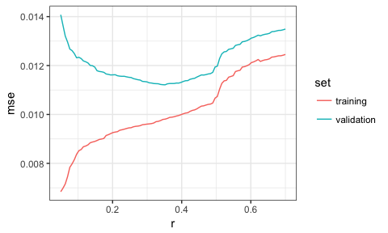

# BAIT 509 Class Meeting 04
Wednesday, March 7, 2018  

## Topics

- Selecting hyperparameters; selecting predictors. 
- parametric vs. non-parametric
- error from adding more predictors
- Generalization error
- Training, validation, and test sets
- Cross validation
- Feature selection; R2adj, AIC. Forward and backward selection?

# Outline

- Out-of-sample error
- Concept of training, validation, and test data.


```r
suppressPackageStartupMessages(library(tidyverse))
suppressPackageStartupMessages(library(knitr))
opts_chunk$set(fig.width=5, fig.height=3, fig.align="center",
               warning=FALSE)
my_accent <- "#d95f02"
rotate_y <- theme(axis.title.y=element_text(angle=0, vjust=0.5))
```


# Out-of-sample Error

## The fundamental problem

First, some terminology: The data that we use to fit a model is called __training data__, and the fitting procedure is called __training__. New data (or at least, data _not_ used in the training process) is called __test data__.

The goal of supervised learning is to build a model that has low error on _new_ (test) data.

\*\*\* A fundamental fact of supervised learning is that the error on the training data will (on average) be __better__ (lower) than the error on new data!

More terminology: __training error__ and __test error__ are errors computed on the respective data sets. Often, the test error is called __generalization error__. 

Let's check using loess on an artificial data set (from last time). Here's the training error (MSE):


```r
set.seed(87)
n <- 200
dat <- tibble(x = c(rnorm(n/2), rnorm(n/2)+5)-3,
              y = sin(x^2/5)/x + rnorm(n)/10 + exp(1))
fit <- loess(y ~ x, data=dat, span=0.3)
yhat <- predict(fit)
mean((yhat - dat$y)^2)
```

```
## [1] 0.009599779
```

Here's the test error:


```r
n <- 1000
newdat <- tibble(x = c(rnorm(n/2), rnorm(n/2)+5)-3,
                 y = sin(x^2/5)/x + rnorm(n)/10 + exp(1))
yhat <- predict(fit, newdata = newdat)
mean((yhat - newdat$y)^2, na.rm = TRUE)
```

```
## [1] 0.0112968
```

If you think this was due to luck, go ahead and try changing the seed -- more often than not, you'll see the test error > training error. 

This fundamental problem exists because, by definition, we build the model to be optimal based on the training data! For example, kNN and loess make a prediction that's _as close as possible_ to the training data. 

The more we try to make the model fit the training data -- i.e., the more we overfit the data -- the worse the problem gets. Let's reduce the loess bandwidth to emulate this effect. Here's the training error:


```r
set.seed(87)
n <- 200
dat <- tibble(x = c(rnorm(n/2), rnorm(n/2)+5)-3,
              y = sin(x^2/5)/x + rnorm(n)/10 + exp(1))
fit <- loess(y ~ x, data=dat, span=0.1)
yhat <- predict(fit)
mean((yhat - dat$y)^2)
```

```
## [1] 0.008518578
```

Test error:


```r
n <- 1000
newdat <- tibble(x = c(rnorm(n/2), rnorm(n/2)+5)-3,
                 y = sin(x^2/5)/x + rnorm(n)/10 + exp(1))
yhat <- predict(fit, newdata = newdat)
mean((yhat - newdat$y)^2, na.rm = TRUE)
```

```
## [1] 0.01233726
```

The effect gets even worse if we have less training data. 

For kNN and loess, we can play with the hyperparameter, weight function, and degree of local polynomial (in the case of regression) to try and avoid overfitting. Playing with these things is often called __tuning__. 

## Solution 1: Use a hold-out set.

One solution is to split the data into two parts: __training__ and __validation__ data. The validation set is called a _hold-out set_, because we're holding it out in the model training. 

Then, we can tune the model (such as choosing the $k$ in kNN or $r$ in loess) to minimize error _on the validation set_.


```r
set.seed(87)
n <- 200
dat <- tibble(x = c(rnorm(n/2), rnorm(n/2)+5)-3,
              y = sin(x^2/5)/x + rnorm(n)/10 + exp(1))
n <- 1000
newdat <- tibble(x = c(rnorm(n/2), rnorm(n/2)+5)-3,
                 y = sin(x^2/5)/x + rnorm(n)/10 + exp(1))
tibble(r = seq(0.05, 0.7, length.out=100)) %>% 
    group_by(r) %>% 
    do({
        this_r <- .$r
        fit <- loess(y ~ x, data=dat, span=this_r)
        yhat_tr  <- predict(fit)
        yhat_val <- predict(fit, newdata = newdat)
        data.frame(
            r = this_r,
            training = mean((yhat_tr - dat$y)^2),
            validation = mean((yhat_val - newdat$y)^2, na.rm = TRUE)
        )
    }) %>% 
    gather(key="set", value="mse", training, validation) %>% 
    ggplot(aes(r, mse)) +
    geom_line(aes(group=set, colour=set)) +
    theme_bw()
```



We would choose a bandwidth ($r$) of approximately 0.35, because the error on the validation set is smallest. 

Notice from this plot:

- The training error is lower than the out-of-sample error.
- We can make the training error arbitrarily small by decreasing $r$. 
- The out-of-sample error decreases, and then starts to increase again.
    - NOTE: This doesn't _always_ happen, as you'll see in Assignment 1. But it usually does. 

After choosing the model that gives the smallest error on the validation set, then the _validation error_ is also going to be on average lower than in a test set -- that is, if we get even more data! The more tuning parameters we optimize using a validation set, the more pronounced this effect will be. Two things to note from this:

1. This is not as bad as the original problem (where the training error is less than the test error), because the tuning parameters are still chosen on an out-of-sample set.
2. If we want to use the validation error as an estimate of the out-of-sample error, we just have to be mindful of the fact that this is an optimistic estimate of the generalization error.

If you wanted an unbiased estimate of generalization error, you can start your procedure by splitting your data into three sets: training and validation as before, but also a test set that is __never touched until you've claimed a final model__! You only use the test set to get an unbiased estimate of generalization error. 

There's not really a standard choice for deciding _how much_ data to put aside for each set, but something like 60% training, 20% validation, and 20% test is generally acceptable.

## Cross-validation

The problem with the training-validation-test set approach is that you're wasting a lot of data -- lots of data are not being used in training! Another problem is that it's not easy to choose how much data to put aside for each set.

A solution is to use ($c$-fold) __cross validation__ (CV), which can be used to estimate out-of-sample error, and to choose tuning parameters. (Note that usually people refer to this as $k$-fold cross validation, but I don't want to overload $k$ from kNN!) $c=10$ is generally accepted as the defacto standard. Taking $c$ equal to the sample size is a special case called leave-one-out cross validation. 

The general procedure is as follows:

1. Partition the data into $c$ (approximately equal) chunks.
2. Hold out chunk 1; train the model on the other $c-1$ chunks; calculate error on the held-out chunk.
3. Hold out chunk 2; train the model on the other $c-1$ chunks; calculate error on the held-out chunk.
4. Hold out chunk 3; train the model on the other $c-1$ chunks; calculate error on the held-out chunk.
5. etc., until you've held out each chunk exactly once.
6. Average the $c$ errors to get an estimate of the generalization error.

You can then repeat this procedure for different values of the tuning parameters, choosing values that give the lowest error. Once you choose this tuning parameter, go ahead and use _all_ the data as training data, with the selected tuning parameters. 

CV is generally preferred to the hold-out set method, because we can fit a model that has overall lower error, but it's computationally expensive. 

# Lab

The last chunk of time for today's class meeting will be used for "lab time". The instruction part of today is over.

- I recommend getting acquainted with RStudio and Jupyter notebooks (or some other way to interact with python) if you haven't already, and ideally, get `git` running locally. Instructions live in the "Lab" section of Class Meeting 01.
    - Note! Using `git` is optional in this course! There is a learning curve, but learning it pays dividends. Just drag-and-drop your in-class work files to your github repo.
    - Using RMarkdown is also optional. Use plain R scripts if you prefer. 
- Work on your first assignment. A TA and I will be around to help.
