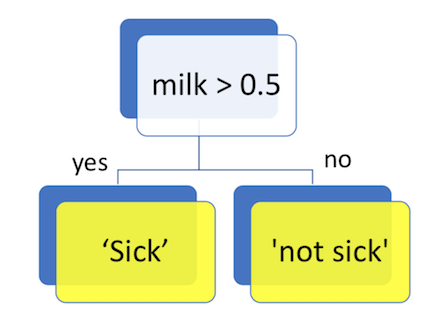

# Outline

- Decision trees
- Bagging, boosting, random forests, model averaging. 

# Decision Trees

Some problems (or at least potential problems) with the local methods introduced last time:

1. They lack interpretation.
    - It's not easy to say how the predictors influence the response from the fitted model.
2. They typically require a data-rich situation so that the estimation variance is acceptable, without compromising the estimation bias. 

Our setting this time is the usual: we have a response $Y$ (either categorical or numeric), and hope to predict this response using $p$ predictors $X_1,\ldots,X_p$. 

- When the response is categorical, we aim to estimate the mode and take that as our prediction.
- When the response is numeric, we aim to estimate the mean, and take that as our prediction. 

## Decision Stumps: A fundamental concept

Let's say I get an upset stomach once in a while, and I suspect certain foods might be responsible. My response and predictors are:

- $Y$: sick or not sick (categorical)
- $X_1$: amount of eggs consumed in a day.
- $X_2$: amount of milk consumed in a day, in liters. 

A __decision stump__ is a decision on $Y$ based on the value of _one_ of the predictors. 

(Image attribution: Hyeju Jang, DSCI 571)

## Learning procedure

Now that we know what a decision stump is, how can we choose the one that gives the highest prediction accuracy? We need to consider two things:

1. which predictor will be involved in the decision, and
2. the boundary on that predictor for which to make a prediction. 

## LAB PORTION

- Example with binary predictor. What would you choose under either case of the predictor?
- What is the accuracy of your predictions, on the training set? (We're not bothering with validation/test sets).
- Draw the decision stump.
- Now consider fitting a decision stump to a continuous predictor. How would you decide where to make the split?
- Why don't we want to fit a decision stump that results in the same decision being made in either case? (i.e., the same category being predicted). What distribution does the corresponding decision correspond to?
- By inspecting the decision tree, draw a picture showing the learned decision tree when the maximum depth is  2.

