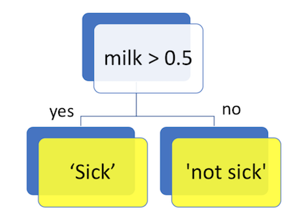

# Outline

- Classification and Regression Trees

Housekeeping:

- Able to submit multiple files to participation folder on canvas?

# Motivation

Some problems (or at least potential problems) with the local methods introduced last time:

1. They lack interpretation.
    - It's not easy to say how the predictors influence the response from the fitted model.
2. They typically require a data-rich situation so that the estimation variance is acceptable, without compromising the estimation bias. 

We'll look at classification and regression trees as another method (sometimes called CART). CARTs are not necessarily better, and in fact, tend to be poor competitors to other methods -- but ensemble extensions of these tend to perform well (a topic for next Monday). 

Our setting this time is the usual: we have a response $Y$ (either categorical or numeric), and hope to predict this response using $p$ predictors $X_1,\ldots,X_p$. 

- When the response is categorical, we aim to estimate the mode and take that as our prediction.
- When the response is numeric, we aim to estimate the mean, and take that as our prediction. 

# Stumps: A preliminary concept

## What are they?

Let's say I get an upset stomach once in a while, and I suspect certain foods might be responsible. My response and predictors are:

- $Y$: sick or not sick (categorical)
- $X_1$: amount of eggs consumed in a day.
- $X_2$: amount of milk consumed in a day, in liters. 

You make a food diary, and record the following:

| Eggs | Milk | Sick? |
|------|------|-------|
| 0    | 0.7  | Yes   |
| 1    | 0.6  | Yes   |
| 0    | 0    | No    |
| 1    | 0.7  | Yes   |
| 1    | 0    | Yes   |
| 0    | 0.4  | No    |

(Example from Mark Schmidt's CPSC 340)

A __decision/classification stump__ is a decision on $Y$ based on the value of _one_ of the predictors. You can make one by doing the following steps:

1. Choose a predictor (in this case, Milk or Eggs?)
2. Choose a cutpoint on that predictor:
    - Subset the data having that predictor _less than_ that cutpoint, and take the mode as your decision/classification.
    - Subset the data having that predictor _greater than_ that cutpoint, and take the mode as your decision/classification.

This will get you a decision/classification stump, like so:

(Image attribution: Hyeju Jang, DSCI 571)

The same idea applies in the regression case, except we take the average of the subsetted data, and choose the best one according to the mean squared error. 

Some things to note:

- A decision on a numeric variable is always made based on a threshold (either less than or greater than). Although it makes sense to talk about a stump based on a more complicated decision, allowing for more complicated decisions would increase the search space, and would make fitting these models impractical. Plus, sometimes a more complicated decision can be broken down into several single-threshold decisions.
- It follows that decisions are always binary. Again, although it makes sense to talk about a stump that has more than two options, we can usually write these as a tree.

## Choosing the best stumps

__Question__: What is the error of the above decision stump? If we decide to make a prediction without a decision stump (or any predictors at all), what would the best prediction be, and what's the error?

We have many stumps we can choose from -- which one is best?

__Classification__:

- The one that gives the least error.
    - Tends to have a harder time disambiguating several options.
- The Gini and Entropy criteria are two of the more commonly used measures.
    - These are measures of __purity__.
    
__Regression__:

- The one that gives the least mean squared error. 

# Partitioning of predictor space

How does a stump partition the predictor space?

# Trees

Notice that a tree is just a bunch of stumps!

This means:

	1. For numeric predictors, decisions can only involve one threshold.
	2. Decisions are always binary.

## Optimal tree -- computationally infeasible

Ideally, we'd examine the error from every possible regression tree, and choose the best one. But there are far too many trees possible! We turn to _recursive binary splitting_ as the next best thing. 

## Recursive Binary Splitting

The idea to making a tree is to take a __greedy__ approach: keep adding decision stumps, each time choosing the best stump.

This is called "greedy" because this method may not end up with the best tree -- it's not computationally feasible to look many steps ahead to see whether a different path is more feasible. 

Adding "Eggs < 1" to the above stump will be the next best iteration -- in this case, resulting in 100% prediction accuracy (on the training data). Notice that every time we add a stump, the error on the training set decreases. 

We keep iterating until we reach some __stopping criterion__, often based on things such as:

- Tree depth
- Number of observations in a leaf becomes too small
- Error is not reduced significantly

__Questions__: 

- How does "tree size" affect the bias-variance tradeoff?
- How can you choose these parameters?

## Pruning

Sometimes, a stopping criterion may cause the tree to stop growing prematurely. For example, perhaps we need an insignificant stump to form before getting a more significant one.

To avoid this, we take the approach of growing an overly large (overfit) tree, and then pruning it. We won't get into details of how the tree is pruned back, but the technique is called _cost complexity pruning_. The general idea is to control a tuning parameter $\alpha$ to control how much pruning is done -- it can be chosen by cross-validation, or the validation set approach.

# Exercise

- Coding a decision tree with `tree::tree()` in R, using the [titanic data](https://raw.githubusercontent.com/vincenzocoia/BAIT509/master/assessments/assignment1/data/titanic.csv).
- `predict()` and `plot()`, and "S3 generics" in R.
