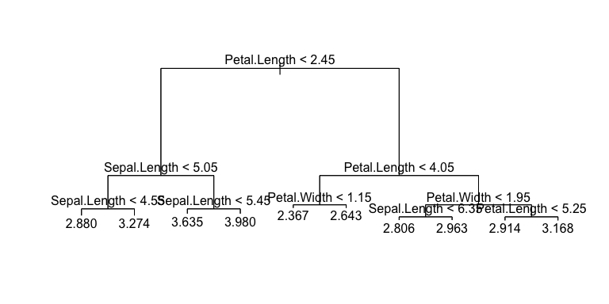
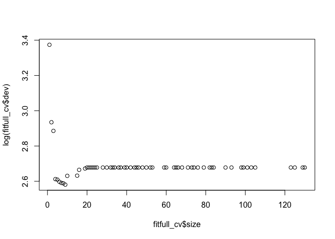
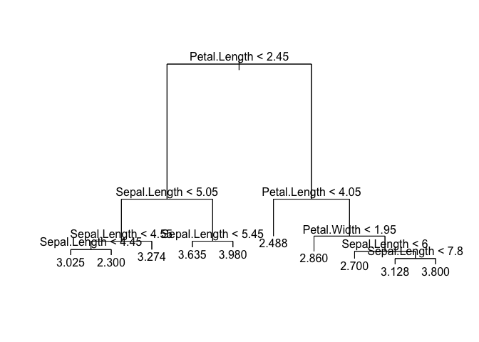

# Objectives

- Classification and regression trees in R; plotting model functions.
- Awareness of the machine learning workflow, with emphasis on asking useful statistical questions.
- Setting up your projects, and getting started with forming your own statistical questions with the help of the teaching team. 

# Classification and Regression Trees: in R

To fit classification and regression trees in R, we use the package `tree` and the function `tree()`, which works similarly to `lm()` and `loess()`:


```r
suppressPackageStartupMessages(library(tree))
suppressPackageStartupMessages(library(tidyverse))
fit <- tree(Sepal.Width ~ ., data=iris)
summary(fit)
```

```
## 
## Regression tree:
## tree(formula = Sepal.Width ~ ., data = iris)
## Variables actually used in tree construction:
## [1] "Petal.Length" "Sepal.Length" "Petal.Width" 
## Number of terminal nodes:  10 
## Residual mean deviance:  0.06268 = 8.776 / 140 
## Distribution of residuals:
##     Min.  1st Qu.   Median     Mean  3rd Qu.     Max. 
## -0.60560 -0.16780  0.03182  0.00000  0.16280  0.63180
```

```r
plot(fit)  # Plot the tree, without labels
text(fit)  # Add labels to the tree
```

<!-- -->

(Messy -- would need to modify the predictor names). Make predictions with `predict`:


```r
predict(fit, newdata=iris) %>% 
    head
```

```
##        1        2        3        4        5        6 
## 3.635294 3.273913 3.273913 3.273913 3.273913 3.635294
```

If you want to control the depth of the tree, use the `tree.control` function in the `control` argument. Arguments of `tree.control` that are relevant are:

- `mindev`: The minimum error reduction acceptable before stopping the tree growth.
- `minsize`: The minimum number of observations required in a node in order for a tree to keep growing.

Let's fit a tree to the max, and check its MSE:


```r
fitfull <- tree(Sepal.Width ~ ., data=iris, 
                control=tree.control(nrow(iris), 
                                     mindev=0, minsize=2))
mean((predict(fitfull) - iris$Sepal.Width)^2)
```

```
## [1] 0.0008666667
```

You can investigate the pruning of a tree via cross validation using the `cv.tree` function. Specify `FUN=prune.misclass` if you want to prune based on classification error instead of purity measurements, for classification. It returns a list, where the important components are named `"size"` (number of terminal nodes) and `"dev"` (the error). Let's plot those:


```r
set.seed(4)
fitfull_cv <- cv.tree(fitfull)
plot(fitfull_cv$size, log(fitfull_cv$dev))
```

<!-- -->

The x-axis represents the number of terminal nodes present in the subtree. The y-axis is the cross-validation error for that subtree. 

From the plot, it looks like it's best to prune the tree to have approximately 10 terminal nodes. Use `prune.tree(fitfull, best=10)` to prune the tree to 10 terminal nodes.

\*Note: if you encounter an error running `prune.tree(fitfull, best=10)`, it's not a true error (I believe it's only an error to the `print` call, which is called by default). Wrap the code with `try`:


```r
fit_pruned <- try(prune.tree(fitfull, best=10))
plot(fit_pruned)
text(fit_pruned)
```

<!-- -->


# Overview of the ML workflow

Today, we're going to take a break from supervised learning methods, and look at the process involved to use machine learning to address a question/problem faced by an organization.

Generally, there are four parts of a machine learning analysis. In order from high to low level:

1. The Business Question/Objective
2. The Statistical Question(s)/Objective(s)
3. The data and model
4. The data product

Doing an analysis is about distilling from the highest level to the lowest level. As such, there are three distillations to keep in mind: 1-2, 2-3, and 3-4:

- 1-2 is about asking the right questions.
    - Our focus today.
- 2-3 is about building a useful model.
    - Our focus for much of the course.
- 3-4 is about communicating the results.

An analysis isn't (_and shouldn't be_) a linear progression through these as if they're "steps"; rather, the process is iterative, revisiting any of the distillations at any point after embarking on the project. This is because _none of the components are independent_. Making progress on any of the three distillations gives you more information as to what the problem is. 


In all of this, it's most beneficial to consider developing your analysis through small, simple steps. Always start with a basic approach, and gradually tweak the various components. Right off the bat, strive to get some sort of crude end product that resembles what your final product might look like. Not only is it more useful to have a "working version" of your product right away, but it gives you more information about the project, and will inform other distillations. 

We'll look at these in turn, in reverse order.

# Communicating (Distillation 3-4)

Once you have a model, it needs to be delivered and used by others. (And if you are truly the only one who will use the model, then you still need to package it up as if it will be used by others, because it will -- the "other" person here is future-you!)

This is typically called the "data product", because it can consist of a variety of things:

- a report
- a presentation
- an app
- a software package/pipeline

...and any combination of these things. These almost always (or at least, almost always _should_) contain data visualizations. 

Your client might request this outright, but their suggestion might not be the best option. Perhaps they request a report and presentation communicating your findings, when a more appropriate product also includes an interactive app that allows them to explore your findings for themselves.

Either way, the key here is communication. The challenges here include: 

- Communication with language: understanding your audience, and tailoring your language for them. This usually means no jargon allowed. The key is to talk more about the output and the general idea of your model(s), but not machine learning or statistical jargon.
- Communication with visual design: this is about choosing what visuals are the most effective for communicating (called design choice). 

It's key when you're developing a first draft to not fret about details. For example, there's no use interpreting the results of an analysis if you know the analysis will change. The idea is to set up a framework. For a report, this means outlining what you intend to write about, and where. 

Having this, and showing it to your client is useful as a sanity check to see that you're about to produce something that the client currently sees as being potentially useful. 

This course is not about developing a data product. This is a topic that can be a discipline on its own, so we will not dwell any more on this.

# Modelling (Distillation 2-3)

This involves things like kNN, loess, classification/regression trees, etc. -- things that the bulk of this course is focussed on. As such, I won't dwell here.

One thing I will say, though, is that there is temptation here to jump immediately into a complex analysis. Resist the temptation. Always start with a very basic approach -- perhaps just linear regression, for example. The amount of complex approaches far exceeds the amount of simple ones, and starting with a simple one will help you end up in an appropriate complex analysis, if one is required.


# Asking useful statistical questions (Distillation 1-2)

Usually, a company is not served up a machine learning problem, complete with data and a description of the response and predictors. Instead, they're faced with some high-level objective/question that we'll call the __business question/objective__, which needs refining to a __statistical question/objective__ -- one that is directly addressable by machine learning.

## Business objectives: examples

Examples of business objectives (for which machine learning is a relevant approach) (more examples at [this altexsoft blog post](https://www.altexsoft.com/blog/business/supervised-learning-use-cases-low-hanging-fruit-in-data-science-for-businesses/)):

- Reduce the amount of spam email received
- Early prediction of product failure
- Find undervalued mines
- Make a transit system more efficient
- Hire efficient staff 

## Statistical objectives: refining

Statistical objectives should be _specific_. For some business objectives, the distillation is not dramatic; for others, it is. Because supervised learning is about predicting a response $Y$ from predictors $X_1, \ldots, X_p$, identifying a statistical objective involves:

- Most importantly, identifying what response is the most valuable/aligned with the business objective.
- Identifying the cases that will be used for learning, and what cases you'll be predicting on.
- What predictors you plan on using, or at least where we'll be looking for these. 
    - Note: half of this is the task of _feature selection_ -- a topic we may cover last in the course -- but, largely, this is a human decision based on what we think is more informative, so is important to include in your supervised learning question/objective.

## Statistical objectives: examples

Statistical objectives corresponding to the above business objective examples might be:

- Predict monthly sales (response) from a personality test (predictors), issued to our current employees (learning cases) and prospective employees (prediction cases).
- Obtain individual-specific classifications of email spam (response) based on features present in the name and body of an email (predictors). Cases of spam will be gathered over time, as the employee manually identifies mistakes in classification (prediction cases become learning cases after emails are viewed).
- Classify a device as either faulty or not (response) based on predictors chosen by expert advice (predictors). Of those predicted faulty, check their performance for one hour (predictors, round 2) to predict lifetime of the device (response, round 2). Sample cases from our test facility will be used (learning cases) to make predictions on items sent to the shelf. 
- Predict total volume of gold and silver at a site (response) based on concentrations of various minerals found in drill samples (predictors). Use cases where total volume is known (learning cases) to make predictions on mines where total volume is not known or uncertain (prediction cases).
- Predict the time it takes a bus to travel between set stops (responses), based on time factors such as time of the day, time of the week, and time of the year (predictors). Use data from the server, available for the past 8 years (learning cases) to make predictions for 2019 (prediction cases). 

## Statistical questions are not the full picture

Almost (?) always, the business objective is more complex than the statistical objective. By refining a business objective to a statistical one, we lose part of the essence of the business objective. 

It's important to have a sense of the ways in which your statistical objective falls short, and the ways in which it's on the mark, so that you keep a sense of the big picture. For instance, you'll better understand how your machine learning model(s) fit into the big picture of the business question, and how you might ask a different statistical question to gain different insight.


## Statistical objectives unrelated to supervised learning

Naturally, for this course, we'll focus on statistical questions that require supervised learning. But in reality, you should consider other cases too. Let's look at other branches of data analysis that you might wish to consider (though, not for this course), through an example.

_Business objective_: To gain insight into the productivity of two branches of a company.

Examples of statistical questions:

- _Hypothesis testing_. Is the mean number of sick days per employee different between two branches of a company?
    - Supervised learning doesn't cover testing for differences. 
- _Unsupervised learning_. What is the mean sentiment of the internal discussion channels from both branches?
    - There are no records of the response here, as required by supervised learning (by definition). 
- _Statistical inference_. Estimate the mean difference in monthly revenue generated by both branches, along with how certain you are with that estimate. 
    - Supervised learning typically isn't concerned about communicating how certain your estimate is.


# Prerequisites to an analysis

Before going into any analysis, you need to know what data are available, and what state they're in. 

__Why__: The statistical questions you form will depend on the data that are available. For example, you can't form a statistical question about the performance of a division of your business if there are no data available on that division, or if the data you collected aren't indicators of performance. 

__How__: Always make exploratory plots to get a feel for the data -- and keep doing so to explore other aspects of the data, as you learn more about the data set by doing your analysis. This is often called _Exploratory Data Analysis_ (or EDA). 


# Lab

For today's lab/practical component, you'll be working with your final project team to start your final projects for this course. Use the help of the teaching team to:

1. Set up the project -- choose the data and business objective.
2. Propose a statistical objective to address this.

Also, elaborate on the statistical objective. What's your plan for the analysis? Share this with the teaching team, so that we can provide some insight.

As I mentioned, always start small and simple.
