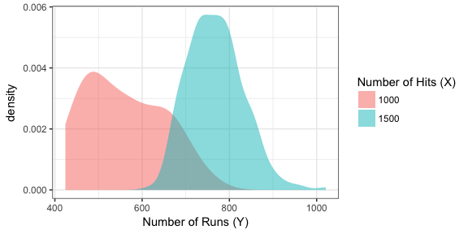
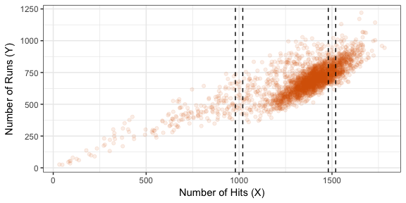
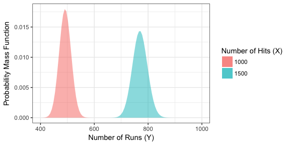
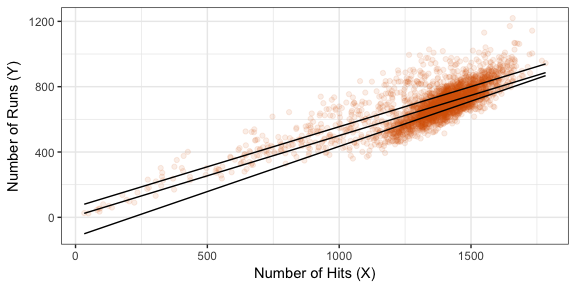
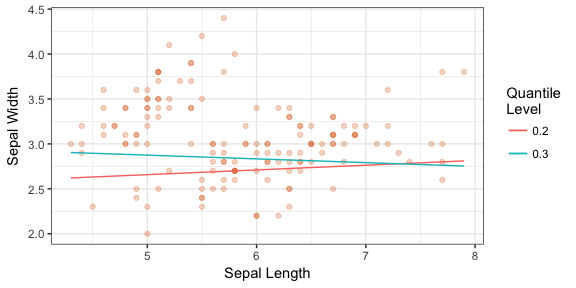
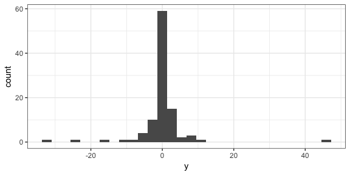
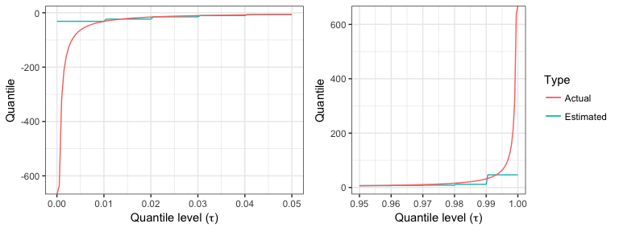
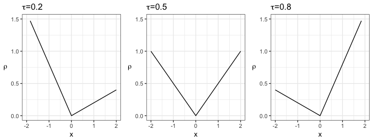

# BAIT 509 Class Meeting 07
2018-03-19  


# Learning Goals

By the end of this lecture, students are expected to know:

- What is "Probabilistic forecasting" and "Quantile regression"; how to interpret the forecasts/predictions; and to have a sense of when it's appropriate to use them.
- Probabilistic forecasts: how to estimate (plot) predictive distribution densities using a "moving window" approach. 
- Quantile Regression:
    - How to fit a linear quantile regression model in R (using both `ggplot2` and the `quantreg` package), and how to interpret it.
    - Understand the "crossing quantile" problem.
    - Know how to evaluate goodness of quantile regression models
    - Know how to estimate a quantile in a univariate sample (both in R and the "formula", but not the optimization problem)

# Orientation within the Big-Picture of Supervised Learning

Up until now, we've only seen different ways of using a predictor to give us more information the __mean__ and __mode__ of the response. The world holds a huge emphasis on the mean and mode, but these are not always what's important. Two alternatives are:

1. __Probabilistic forecasting__
2. __Quantile Regression__ (numeric response only)

We will view these concepts in terms of __predicting/forecasting__, touching on two major concepts:

- Methods of obtaining a model/estimates, and
- How to assess goodness of a model.

# Probabilistic Forecasting

## What it is

The idea here is to put forth an _entire probability distribution_ as a prediction. This type of forecast/prediction contains the most amount of information about the response as possible, because it communicates the entire belief of what $Y$ values are most plausible, given values of the predictor.

Predictions/forecasts here are called __predictive distributions__.

From [@gneiting_raftery]:

> Indeed, over the past two decades, probabilistic forecasting has 
> become routine in such applications as weather and climate prediction
> (Palmer 2002; Gneiting and Raftery 2005), computational finance 
> (Duffle and Pan 1997), and macroeconomic forecasting
> (Garratt, Lee, Pesaran, and Shin 2003; Granger 2006).

Before we see how to do this, let's look at an example of what we mean by "probabilistic forecast".

#### Example

Task: we want to predict the number of runs from two baseball teams: one that makes 1000 hits, and another that makes 1500 hits. We'll use the `Teams` data from the `Lahman` package in R.

Here are the estimated densities of "runs" in either case:



Don't you think this is far more informative than the mean estimates in the below table?


 Number of Hits (X)   Expected Number of Runs (E(Y))
-------------------  -------------------------------
               1000                              558
               1500                              768

We could also convey the predictive distribution using other means, such as the cdf or quantile function, but visually, the density is most interpretable.

## Methods and Estimation

### Non-parametric: Local methods

Local methods don't assume anything about the data. The idea is the same as in loess: use "nearby" data to form an estimate at any given $x$ value.

The simplest case is to use a "moving window", which I used in the example above. In that example, I just used all data within ``20`` hits of 1000 and 1500, respectively, and made kernel density estimates of the subsetted data. Visually, you can see the data that I subsetted within these two narrow windows:



You could also form an empirical cdf of the subsetted data if you want an estimate of the cdf. 

There are ways to generalize this by down-weighting data that are further away by using other kernel functions. You can even take this a step further and use local polynomials. But we won't touch on these.

### Non-parametric: Other

The methods you learned in DSCI 571 (Supervised Learning I) can be used to produce probabilistic forecasts.

- __kNN__: Use the $k$ nearest neighbours to build your distribution estimate.
- __decision trees__: Use the data at each node to build your distribution estimate.
- __SVM__: Use the data within each region to build your distribution estimate.
- __Naive Bayes__ (categorical response): This algorithm outputs numbers proportional to the probabilities for each category -- just normalize these to get a pmf estimate. 

### GLM's

When you fit a GLM, you already have the info needed to produce a probabilistic forecast. This is because, in addition to specifying the relationship between the predictors and the mean, we also specify a distribution of the response (such as Poisson, Bernoulli, or Gaussian).

Using a Poisson GLM, the predicted distributions are


 Number of Hits (X)  Distribution of Runs 
-------------------  ---------------------
               1000  Poisson(491.8)       
               1500  Poisson(769.8)       

Plotted, their pmf estimates are:




## Evaluating Model Goodness


The question here is: once you have a model, how can you measure the model goodness? In other words, if you have two or more models, how can you tell which one is producing "better" forecast distributions?

This is an active area of research. The idea is to use a _proper scoring rule_ -- a way of assigning a score based on the forecast distribution and the outcome only, that _also encourages honesty_. We won't go into details -- see [@gneiting_raftery] for details.

_At the very least_, one should check that the forecast distributions are "calibrated" -- that is, the actual outcomes are spread evenly amongst the forecasts. You can check this by applying the forecast cdf to the corresponding outcome -- the resulting sample should be Uniform(0,1). Note that this is built-in to at least some proper scoring rules.

# Quantile Regression

Probabilistic forecasts are useful if you're making a small amount of decisions at a time. For example:

- Predicting which hockey team will win the Stanley Cup
- Looking at the 2-day-ahead prediction of river flow every day to decide whether to take flood mitigation measures.

But they are not appropriate when making decisions en-masse. For example:

- A bus company wants to know how long it takes a bus to travel between stops, for all stops and all busses.
- You want to predict future behaviour of customers.

Most people think they should use estimates of the mean to make decisions. But, the mean is not always appropriate:

- Sometimes there are outliers, in which case the median is a more robust measure of central tendency.
    - For example, there was a very large flu outbreak in 2009.
- Sometimes a conservative/liberal estimate is wanted.
    - For example, the bus company wants conservative estimates so that _most_ busses fall within the estimated travel time. 

In these cases, we care about _quantiles_, not the mean. Estimating them is called __quantile regression__ (as opposed to __mean regression__).

Recall what quantiles are: the $\tau$-quantile (for $\tau$ between 0 and 1) is the number that will be exceeded by the outcome with a $(1-\tau)$ chance. In other words, there is a probability of $\tau$ that the outcome will be _below_ the $\tau$-quantile.

$\tau$ is referred to as the _quantile level_, or sometimes the _quantile index_. 

For example, the bus company might want to predict the 0.8-quantile of transit time -- 80% of busses will get to their destination within that time.

__Be warned__: you may have a hard time convincing people that quantiles are actually what they care about, because the world is trained to think about the mean. Quantiles are also harder to interpret.

## Linear Quantile Regression

### The Model

The idea here is to model
$$Q(\tau)=\beta_0(\tau) + \beta_1(\tau) X_1 + \cdots + \beta_p(\tau) X_p,$$
where $Q(\tau)$ is the $\tau$-quantile. In other words, __each quantile level gets its own line__, and are each fit independently of each other. 

Here are the 0.25-, 0.5-, and 0.75-quantile regression lines:


```
## Loading required package: SparseM
```

```
## 
## Attaching package: 'SparseM'
```

```
## The following object is masked from 'package:base':
## 
##     backsolve
```

```
## Smoothing formula not specified. Using: y ~ x
```



I did this easily with `ggplot2`, just by adding a layer `geom_quantile` to my scatterplot, specifying the quantile levels with the `quantiles=` argument. We could also use the function `rq` in the `quantreg` package in R:


```r
(fit_rq <- rq(runs ~ hits, data=dat, tau=c(0.25, 0.5, 0.75)))
```

```
## Call:
## rq(formula = runs ~ hits, tau = c(0.25, 0.5, 0.75), data = dat)
## 
## Coefficients:
##                tau= 0.25 tau= 0.50  tau= 0.75
## (Intercept) -118.8297872 8.2101818 64.0347349
## hits           0.5531915 0.4923636  0.4908592
## 
## Degrees of freedom: 2835 total; 2833 residual
```

If we were to again focus on the two teams (one with 1000 hits, and one with 1500 hits), we have (by evaluating the above three lines):


 Number of Hits (X)   0.25-quantile   0.5-quantile   0.75-quantile
-------------------  --------------  -------------  --------------
               1000             434            501             555
               1500             711            747             800

So, we could say that the team with 1000 hits: 

- is estimated to have a 50% chance to have between 434 and 555 runs; 
- has a 25% chance of achieving over 555 runs;
- has a 25% chance of getting less than 434 runs;
- would typically get 501 runs (median);

amongst other things. 

### Problem: Crossing quantiles

Because each quantile is allowed to have its own line, some of these lines might cross, giving an __invalid result__. Here is an example with the `iris` data set, fitting the 0.2- and 0.3-quantiles:


```
## Smoothing formula not specified. Using: y ~ x
## Smoothing formula not specified. Using: y ~ x
```



Quantile estimates of Sepal Width for plants with Sepal Length less than ``7.3`` are valid, but otherwise, are not. For example, for plants with a Sepal Length of 8, this model predicts 30% of such plants to have a Sepal Width of less than ``2.75``, but only 20% of such plants should have Sepal Width less than ``2.82``. This is an illogical statement. 

There have been several "adjustments" proposed to ensure that this doesn't happen (see below), but ultimately, this suggests an inadequacy in the model assumptions. Luckily, this usually only happens at extreme values of the predictor space, and/or for large quantile levels, so is usually not a problem. 

- Bondell HD, Reich BJ, Wang H. Noncrossing quantile regression curve estimation. Biometrika. 2010;97(4):825-838.
- Dette H, Volgushev S. Non-crossing non-parametric estimates of quantile curves. J R Stat Soc Ser B Stat Methodol. 2008;70(3):609-627.
- Tokdar ST, Kadane JB. Simultaneous linear quantile regression: a semiparametric Bayesian approach. Bayesian Anal. 2011;6(4):1-22.

### Problem: Upper quantiles

Estimates of higher quantiles usually become worse for large/small values of $\tau$. This is especially true when data are heavy-tailed. 

Here is a histogram of 100 observations generated from a Student's _t_(1) distribution (it's heavy-tailed):


```
## `stat_bin()` using `bins = 30`. Pick better value with `binwidth`.
```



Here are estimates of high and low quantiles, compared to the actual. You can see the discrepency grows quickly. __Extreme-low quantiles are too high__, whereas __extreme-high quantiles are too low__. 





As a rule of thumb, it's best to stay below $\tau=0.95$ or above $\tau=0.05$. If you really want estimates of these extreme quantiles, you'll need to turn to __Extreme Value Theory__ to make an assumption on the tail of the distribution of the data. One common approach is to fit a generalized Pareto distribution to the upper portion of the data, after which you can extract high quantiles. 

## Evaluating Model Goodness

The question here is: if we have two or more models that predicts the $\tau$-quantile, which model is best? We'll need some way to score different models to do things such as:

- Choose which predictors to include in a model;
- Choose optimal hyperparameters;
- Estimate parameters in a quantile regression model.

\*\*__NOTE__\*\*: __Mean Squared Error is not appropriate here!!__ This is very important to remember. 

The reason is technical -- the MSE is not a _proper scoring rule_ for quantiles. In other words, the MSE does not elicit an honest prediction. 

A "correct" scoring rule for the $\tau$-quantile is as follows:
$$ S = \sum_{i=1}^{n} \rho_{\tau}(Y_i - \hat{Q}_i(\tau)), $$
where $Y_i$ for $i=1,\ldots,n$ is the response data, $\hat{Q}_i(\tau)$ are the $\tau$-quantile estimates, and $\rho_{\tau}$ is the __check function__ (also known as the _absolute asymmetric deviation function_ or _tick function_), given by
$$ \rho_{\tau}(s) = (\tau - I(s<0))s $$
for real $s$. This scoring rule is __negatively oriented__, meaning the lower the score, the better. It cannot be below 0. 

Here is a plot of various check functions. Notice that, when $\tau=0.5$ (corresponding to the median), this is proportional to the absolute value:



Note that there _are_ more scoring rules we can use, other than this. In fact, for any increasing function $g$, we can wrap $Y_i$ and $\hat{Q}_i(\tau)$ by $g$, and end up with another proper scoring rule. I recommend using $g=\log$ if you suspect your data are heavy-tailed, otherwise the scoring rule may not converge (in the $n \rightarrow \infty$ sense).

Are there _even more_ scoring rules we can use? Maybe, but the world currently doesn't know whether or not there are!

One downfall to these scoring rules: there is no known interpretation like there is for MSE (or root MSE). The "final score" doesn't mean anything in and of itself; we can only use it to _compare_ different models.

## Estimation

There are two approaches we can take to obtain quantile estimates.

### Estimation as an Optimization Problem

Now that you know of a way to evaluate the goodness of quantile regression models, parameter estimation follows quite naturally. 

For the linear quantile regression model, just take the $\beta$'s that lead to the best (lowest) score!

Specifically, the formula for finding the $\beta$ estimates of the $\tau$-quantile is:
$$ \hat{\boldsymbol{\beta}}(\tau) = \text{arg min}_{\boldsymbol{\beta}} \sum_{i=1}^{n} \rho_{\tau}(Y_i - \beta_0 - \beta_1 X_{1i} - \cdots - \beta_p X_{pi}). $$

In fact, mean regression does this too -- it chooses values of the parameters that minimize the MSE. That's all Ordinary Least Squares is! Hence, this is why we also consider MSE as a measure of model goodness in mean regression.

### Estimation as a Univariate Plug-in Estimator

If we don't have any predictors, i.e., we just have a univariate sample, the optimization problem reduces to a form that is easier to compute. 

The standard way to estimate the $\tau$-quantile from a sample of size $n$ is to take the $n\tau$'th smallest observation, rounded up. 

For example, here is a random Gaussian sample of size 10, ordered from smallest to largest:


```
##  [1] -1.219 -1.152 -0.962 -0.293  0.030  0.085  0.196  0.259  1.117  1.267
```

The 0.3-quantile estimate is the third number, ``-0.962``. The 0.21-quantile estimate is also the third number. 

There are other estimates: the inverse of any cdf estimate is also a quantile estimate. 

R has nine estimation methods implemented in the function `quantile`, with the `type` argument. The default is "type 7", a continuous version of a quantile estimator; the above described one is "type 1".

__FYI__: Applying Ordinary Least Squares to a univariate sample results in the sample mean.

## Non-linear Quantile Regression

Almost (?) all supervised learning techniques with a numeric response can be extended to quantile regression. For example:

- __kNN__: Use a sample quantile estimator on the $k$ nearest neighbours to get the quantile estimate at a particular $x$.
- __loess__: Same idea as mean regression -- just use the appropriate check function in place of squared error.
- __Regression trees__: Use a sample quantile estimator on the data within each node. 
- __SVM__: as in regression trees.
- __Splines__: Same idea as the mean, but use the appropriate check function in place of squared error. 


# Conclusion

In this program (and in the world), we focus a lot on various ways of predicting the __mean__ (numeric response) and __mode__ (categorical response) -- that's what supervised learning is. But almost all the techniques you learn can be used for estimating __quantiles__, and sometimes even __predictive distributions__, which are sometimes more useful than the mean or mode. Always consider _what_ quantity is more appropriate to investigate.
