```r
suppressPackageStartupMessages(library(tidyverse))
suppressPackageStartupMessages(library(Lahman))
suppressPackageStartupMessages(library(knitr))
opts_chunk$set(warning=FALSE, fig.width=6, fig.height=3, fig.align="center")
my_accent <- "#d95f02"
```

# Outline

Housekeeping:

- Office hour room moved to ESB 3174 when possible.
- Can't accept late submissions for Assignments 2+. Solutions made available right away.
- Questions for Assignment 2?
	- Hint for ISLR 8(c): `prune.tree()` from the `tree` package in R will prune a fitted tree. 

Concepts:

- CART:
	1. For numeric predictors, decisions can only involve one threshold.
	2. Decisions are always binary.
- What is "Probabilistic forecasting" and "Quantile regression"; how to interpret the forecasts/predictions; and to have a sense of when it's appropriate to use them.
- Probabilistic forecasts: how to estimate (plot) predictive distribution densities using subset approaches. 
- Quantile Regression:
    - How to fit a linear quantile regression model in R (using both `ggplot2` and the `quantreg` package), and how to interpret it.
    - Understand the "crossing quantile" problem.
    - Know how to evaluate goodness of quantile regression models

# Orientation within the Big-Picture of Supervised Learning

Up until now, we've only seen different ways of using a predictor to give us more information the __mean__ and __mode__ of the response. The world holds a huge emphasis on the mean and mode, but these are not always what's important. Two alternatives are:

1. __Probabilistic forecasting__
2. __Quantile Regression__ (numeric response only)

# Probabilistic Forecasting: What it is

The idea here is to put forth an _entire probability distribution_ as a prediction. 

Let's look at an example. Suppose there are two baseball teams, one that gets 1000 total hits in a year, and another that gets 1500. Using "total hits in a year" as a predictor, we set out to predict the total number of runs of both teams. Here's the top snippet of the data:


```r
dat <- Teams %>% tbl_df %>% 
    select(runs=R, hits=H)
kable(head(dat))
```


 runs   hits
-----  -----
  401    426
  302    323
  249    328
  137    178
  302    403
  376    410

Let's not concern ourselves with the _methods_ yet. Using a standard regression technique, here are our predictions:


 Number of Hits (X)   Expected Number of Runs (E(Y))
-------------------  -------------------------------
               1000                              558
               1500                              768

Using a probabilistic forecast, here are our predictions:

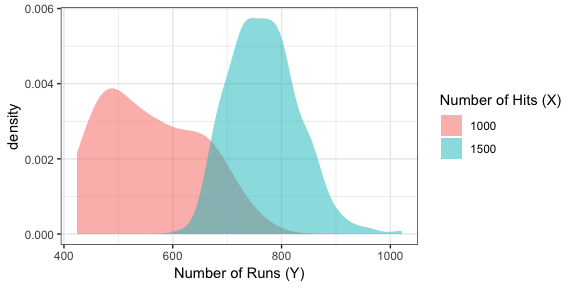

Don't you think this is far more informative than the mean estimates in the above table?

The probabilistic forecast/prediction contains the most amount of information about the response as possible (based on a set of predictors), because it communicates the entire belief of what $Y$ values are most plausible, given values of the predictor.

Predictions/forecasts here are called __predictive distributions__.

From [@gneiting_raftery]:

> Indeed, over the past two decades, probabilistic forecasting has 
> become routine in such applications as weather and climate prediction
> (Palmer 2002; Gneiting and Raftery 2005), computational finance 
> (Duffle and Pan 1997), and macroeconomic forecasting
> (Garratt, Lee, Pesaran, and Shin 2003; Granger 2006).


# Review: Univariate distribution estimates

Let's review how to estimate a univariate probability density function or probability mass function.

## Continuous response

Here's a random sample of 10 continuous variables, ordered from smallest to largest, stored in the variable `x`:


```r
x
```

```
##  [1] -19.8 -13.6 -12.0  -3.5  -2.8   4.4   4.5  15.1  16.3  20.2
```

Recall that we can use __histograms__ to estimate the density of the data. The idea is:

1. Cut the range of the data into "bins" of a certain width.
    - For these data, the range is 40. Let's set up four bins of width 10: -19.8 to -9.8, -9.8 to 0.2, etc.
2. Count the number of observations that fall into each bin.
    - For our setup, the number of observations falling into the four bins, in order, are: 3,2,2,3.
3. Make a bar plot (with no space between the bars), where the bar width corresponds to the bins, and the bar height corresponds to the number of observations in that bin.
    - For our setup, we have:
    

```r
ggplot(data.frame(x=x), aes(x)) +
    geom_histogram(binwidth=10, center=min(x)+5,
                   fill=my_accent, colour="black") +
    theme_bw()
```

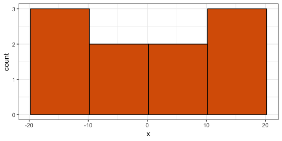

(Note: this is not a true density, since the area under the curve is not 1, but the shape is what matters)

You'd have to play with the binwidth to get a histogram that looks about right (not too jagged, not too coarse). For the above example, there are too few data to make a good estimate. Let's now generate 1000 observations, and make a histogram using `qplot` from R's `ggplot2` package, with a variety of binwidths -- too small, too large, and just right.


```r
x <- rnorm(1000, sd=10)
qplot(x, binwidth=1)  # too small
```

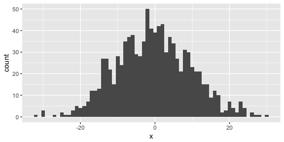

```r
qplot(x, binwidth=10)  # too big
```

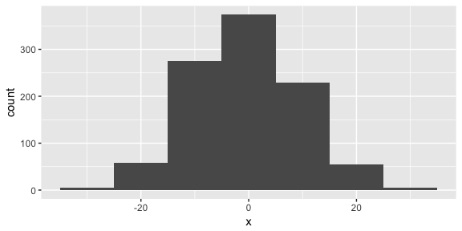

```r
qplot(x, binwidth=3.5)  # just right
```

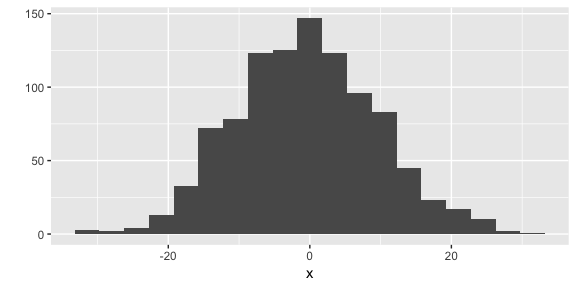

__Advanced method__: There's a technique called the _kernel density estimate_ that works as an alernative to the histogram. The idea is to put a "little mound" (a kernel) on top of each observation, and add them up. Instead of playing with the binwidth, you can play with the "bandwidth" of the kernels. Use `geom="density"` in `qplot`, and use `bw` to play with the bandwidth:


```r
qplot(x, geom="density", bw=2.5)
```

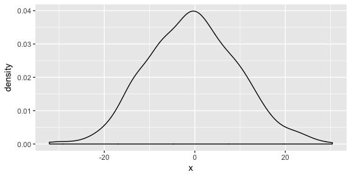

## Discrete Response

When the response is discrete (this includes categorical), the approach is simpler:

1. Calculate the proportion of observations that fall into each category.
2. Make a bar chart, placing a bar over each category, and using the proportions as the bar heights.

Here are ten observations, stored in `x`:


```r
x
```

```
##  [1] 1 0 0 0 2 0 1 2 3 0
```

The proportions are as follows:


```r
props <- tibble(Value=x) %>% 
    group_by(Value) %>% 
    summarize(Proportion=length(Value)/length(x))
kable(props)
```


 Value   Proportion
------  -----------
     0          0.5
     1          0.2
     2          0.2
     3          0.1

You can plot these proportions with `qplot`, specifying `geom="col"`:


```r
qplot(x=Value, y=Proportion, data=props, geom="col")
```

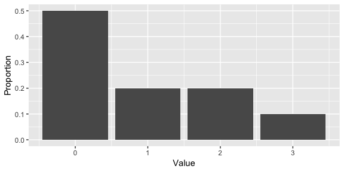

You can use `ggplot2` to calculate the proportions, but it's more complex. It's easier to plot the raw counts, instead of proportions -- and that's fine, you'll still get the same shape. Using `qplot` again, let's make a plot for 1000 observations (note that I indicate that my data are discrete by using the `factor` function):


```r
set.seed(2)
x <- rpois(1000, lambda=1)
qplot(factor(x))
```

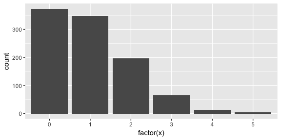

Here's the code to get proportions instead of counts:

```
qplot(factor(x), mapping=aes(y=..prop..), group=1)
```


# Probabilistic Forecasts: subset-based learning methods

## The techniques

The local methods and classification/regression trees that we've seen so far can be used to produce probabilistic forecasts. For local methods, let's ignore the complications of kernel weighting and local polynomials. These methods result in a _subset_ of the data, for which we're used to taking the mean or mode. Instead, _use the subsetted data to plot a distribution_.

- For kNN, form a histogram/density plot/bar plot using the $k$ nearest neighbours.
- For the moving window (loess), form a histogram/density plot/bar plot using the observations that fall in the window.
- For tree-based methods, use the observations within a leaf to form a histogram/density plot/bar plot for that leaf.

The above baseball example used a moving window with a radius of ``20`` hits. Visually, you can see the data that I subsetted within these two narrow windows, for hits of 1000 and 1500:


```r
ggplot(dat, aes(hits, runs)) +
    geom_point(colour=my_accent, alpha=0.1) +
    geom_vline(xintercept=c(1000+c(-r,r), 1500+c(-r,r)),
               linetype="dashed") +
    theme_bw() +
    labs(x="Number of Hits (X)",
         y="Number of Runs (Y)")
```

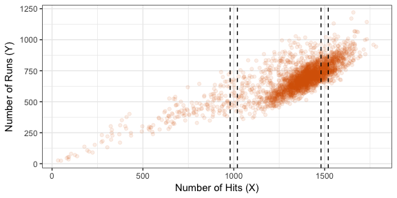

## Bias-variance tradeoff

Let's examine the bias-variance / overfitting-underfitting tradeoff with kNN-based probabilistic forecasts. I'll run a simulation like so:

- Generate data from a bivariate Normal distribution, so that $X \sim N(0, 100)$, and $Y = X + N(0, 100)$.
- Training data will contain 500 observations, for which a kNN probabilistic forecast will be built when $X=25$.
- Try both a small (k=15) and large (k=100) value of $k$.
- For each value of $k$, we'll generate 20 training data sets.

Here are the 20 estimates for the values of $k$. The overall mean of the distributions are indicated by a vertical dashed line.

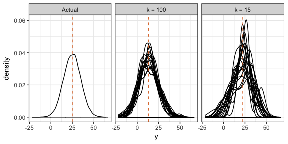

Notice that:

- When $k$ is large, our estimates are biased, because the distributions are not centered correctly. But, the estimates are more consistent.
- When $k$ is small, our estimates are less biased, because the distributions overall have a mean that is close to the true mean. But the variance is high -- we get all sorts of distribution shapes here.

A similar thing happens with a moving window, with the window width parameter. For tree-based methods, the amount that you partition the predictor space controls the bias-variance tradeoff.

## Evaluating Model Goodness

To choose a balance between bias and variance, we need a measure of prediction goodness. When predicting the mean, the MSE works. When predicting the mode, the classification error works. But what works for probabilistic forecasts?

This is an active area of research. The idea is to use a _proper scoring rule_ -- a way of assigning a score based on the forecast distribution and the outcome only, that _also encourages honesty_. We won't go into details -- see [@gneiting_raftery] for details.

_At the very least_, one should check that the forecast distributions are "calibrated" -- that is, the actual outcomes are spread evenly amongst the forecasts. You can check this by applying the forecast cdf to the corresponding outcome -- the resulting sample should be Uniform(0,1). Note that this is built-in to at least some proper scoring rules.

For this course, we won't be picky about how you choose your tuning parameters. Just look for a subset that you think has "enough" observations in it so that the distribution starts to take some shape, but not so much that it starts to shift.

# In-class exercises

For (1) and (2) below, you're choosing between two candidates to hire. Discuss the pros and cons of choosing one candidate over the other in the following situations.

1. Both are predicted to have the same productivity score of 75, but have the following probabilistic forecasts.

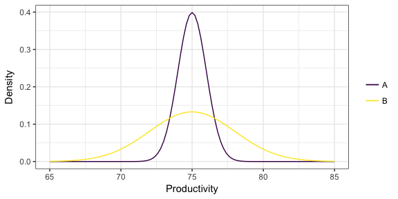

> It's hard to make a decision here. On the one hand, we can be fairly certain that the _actual_ productivity of candidate A will be about 75, but there's more of a gamble with candidate B. There's a very real chance that B's productivity is actually quite a bit higher than A -- for example, a productivity of 80 is plausible for B, but not for A. On the other hand, there's also a very real chance that B's productivity is actually quite a bit _lower_ than A, for the same reason. Your decision would depend on whether you would want to take a risk or not.

> On the other hand, in reality, this is only one tool out of many other aspects of the candidate that you would consider. It might be a good idea to chat with B to get a better sense of what their productivity might actually be.

2. Two "non-overlapping" forecasts:

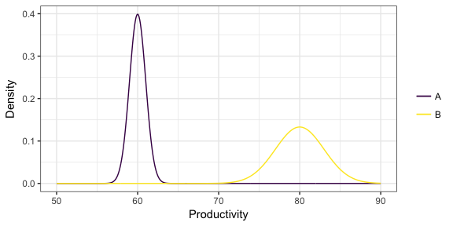

> In this case, B is very very likely to have higher productivity than A, because all "plausible" productivity values for B are higher than all "plausible" productivity values of A.

> Again, this is just one tool you might use to make a decision. 

3. You've formed a probabilistic forecast for a particular value of the predictors, displayed below as a density. You then collect test data for that same value of the predictor, indicated as the points below the density. What is the problem with the probabilistic forecast?

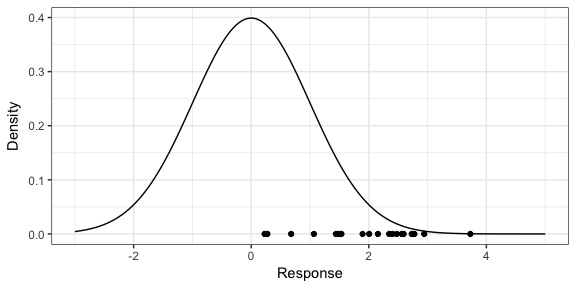

> The forecast is biased, because the actual values are occuring near the upper tail of the distribution -- they _should_ be scattered about the middle, with a higher density of points occuring near 0. If using local methods, we'd have to reduce $k$ or the window width to decrease bias (to remove "further" data that are less relevant); if using a tree-based method, you could grow the tree deeper to lower the bias. 

# Quantile Regression

Probabilistic forecasts are useful if you're making a small amount of decisions at a time. For example:

- Predicting which hockey team will win the Stanley Cup
- Looking at the 2-day-ahead prediction of river flow every day to decide whether to take flood mitigation measures.

But they are not appropriate when making decisions en-masse. For example:

- A bus company wants to know how long it takes a bus to travel between stops, for all stops and all busses.
- You want to predict future behaviour of customers.

It's common to "default" to using the mean to make decisions. But, the mean is not always appropriate (I wrote a [blog post](https://vincenzocoia.github.io/20180218-mean/) about this):

- Sometimes there are outliers, in which case the median is a more robust measure of central tendency.
    - For example, there was a very large flu outbreak in 2009.
- Sometimes a conservative/liberal estimate is wanted.
    - For example, the bus company wants conservative estimates so that _most_ busses fall within the estimated travel time. 

In these cases, we care about _quantiles_, not the mean. Estimating them is called __quantile regression__ (as opposed to __mean regression__).

Recall what quantiles are: the $\tau$-quantile (for $\tau$ between 0 and 1) is the number that will be exceeded by the outcome with a $(1-\tau)$ chance. In other words, there is a probability of $\tau$ that the outcome will be _below_ the $\tau$-quantile.

$\tau$ is referred to as the _quantile level_, or sometimes the _quantile index_. 

For example, the bus company might want to predict the 0.8-quantile of transit time -- 80% of busses will get to their destination within that time.

__Be warned__: you may have a hard time convincing people that quantiles are actually what they care about, because the world is trained to think about the mean. Quantiles aside from the median are also harder to interpret.

## Linear Quantile Regression

The idea here is to model
$$Q(\tau)=\beta_0(\tau) + \beta_1(\tau) X_1 + \cdots + \beta_p(\tau) X_p,$$
where $Q(\tau)$ is the $\tau$-quantile. In other words, __each quantile level gets its own line__, and are each fit independently of each other. 

Here are the 0.25-, 0.5-, and 0.75-quantile regression lines for the baseball data:


```r
ggplot(dat, aes(hits, runs)) +
    geom_point(alpha=0.1, colour=my_accent) +
    geom_quantile(colour="black") +
    theme_bw() +
    labs(x="Number of Hits (X)",
         y="Number of Runs (Y)")
```

```
## Loading required package: SparseM
```

```
## 
## Attaching package: 'SparseM'
```

```
## The following object is masked from 'package:base':
## 
##     backsolve
```

```
## Smoothing formula not specified. Using: y ~ x
```

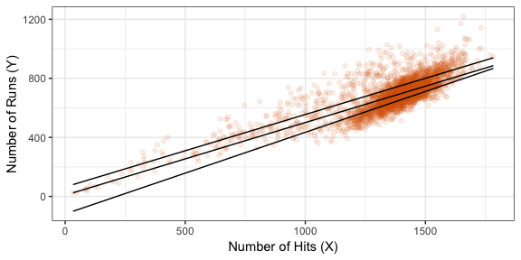

I did this easily with `ggplot2`, just by adding a layer `geom_quantile` to my scatterplot, specifying the quantile levels with the `quantiles=` argument. We could also use the function `rq` in the `quantreg` package in R:


```r
(fit_rq <- rq(runs ~ hits, data=dat, tau=c(0.25, 0.5, 0.75)))
```

```
## Call:
## rq(formula = runs ~ hits, tau = c(0.25, 0.5, 0.75), data = dat)
## 
## Coefficients:
##                tau= 0.25 tau= 0.50  tau= 0.75
## (Intercept) -118.8297872 8.2101818 64.0347349
## hits           0.5531915 0.4923636  0.4908592
## 
## Degrees of freedom: 2835 total; 2833 residual
```

If we were to again focus on the two teams (one with 1000 hits, and one with 1500 hits), we have (by evaluating the above three lines):


```r
predict(fit_rq, newdata=data.frame(hits=c(1000, 1500)))
```

```
##   tau= 0.25 tau= 0.50 tau= 0.75
## 1  434.3617  500.5738  554.8940
## 2  710.9574  746.7556  800.3236
```

So, we could say that the team with 1000 hits: 

- is estimated to have a 50% chance to have between 434 and 555 runs; 
- has a 25% chance of achieving over 555 runs;
- has a 25% chance of getting less than 434 runs;
- would typically get 501 runs (median);

amongst other things. 

## Problem: Crossing quantiles

Because each quantile is allowed to have its own line, some of these lines might cross, giving an __invalid result__. Here is an example with the `iris` data set, fitting the 0.2- and 0.3-quantiles:


```r
ggplot(iris, aes(Sepal.Length, Sepal.Width)) +
    geom_point(alpha=0.25, colour=my_accent) +
    geom_quantile(aes(colour="0.2"), quantiles=0.2) +
    geom_quantile(aes(colour="0.3"), quantiles=0.3) +
    scale_colour_discrete("Quantile\nLevel") +
    theme_bw() +
    labs(x="Sepal Length",
         y="Sepal Width")
```

```
## Smoothing formula not specified. Using: y ~ x
## Smoothing formula not specified. Using: y ~ x
```

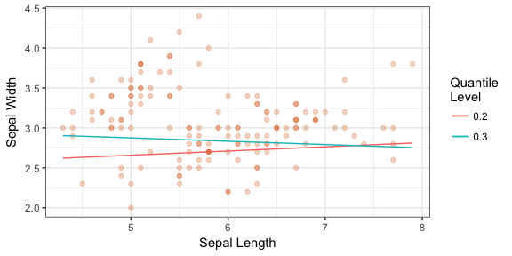

```r
fit_iris <- rq(Sepal.Width ~ Sepal.Length, data=iris, tau=2:3/10)
b <- coef(fit_iris)
at8 <- round(predict(fit_iris, newdata=data.frame(Sepal.Length=8)), 2)
```

Quantile estimates of Sepal Width for plants with Sepal Length less than ``7.3`` are valid, but otherwise, are not. For example, for plants with a Sepal Length of 8, this model predicts 30% of such plants to have a Sepal Width of less than ``2.75``, but only 20% of such plants should have Sepal Width less than ``2.82``. This is an illogical statement. 

There have been several "adjustments" proposed to ensure that this doesn't happen (see below), but ultimately, this suggests an inadequacy in the model assumptions. Luckily, this usually only happens at extreme values of the predictor space, and/or for large quantile levels, so is usually not a problem. 

- Bondell HD, Reich BJ, Wang H. Noncrossing quantile regression curve estimation. Biometrika. 2010;97(4):825-838.
- Dette H, Volgushev S. Non-crossing non-parametric estimates of quantile curves. J R Stat Soc Ser B Stat Methodol. 2008;70(3):609-627.
- Tokdar ST, Kadane JB. Simultaneous linear quantile regression: a semiparametric Bayesian approach. Bayesian Anal. 2011;6(4):1-22.

## Problem: Upper quantiles

Estimates of higher quantiles usually become worse for large/small values of $\tau$. This is especially true when data are heavy-tailed. 

Here is a histogram of 100 observations generated from a Student's _t_(1) distribution (it's heavy-tailed):


```r
set.seed(4)
y <- rt(100, df=1)
qplot(y) + theme_bw()
```

```
## `stat_bin()` using `bins = 30`. Pick better value with `binwidth`.
```

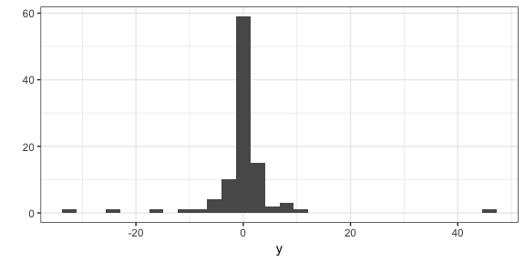

Here are estimates of high and low quantiles, compared to the actual. You can see the discrepency grows quickly. __Extreme-low quantiles are too high__, whereas __extreme-high quantiles are too low__. 


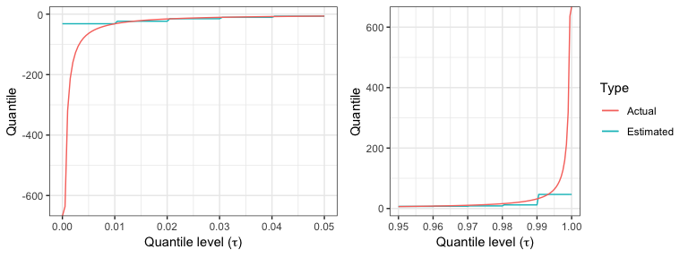


As a rule of thumb, it's best to stay below $\tau=0.95$ or above $\tau=0.05$. If you really want estimates of these extreme quantiles, you'll need to turn to __Extreme Value Theory__ to make an assumption on the tail of the distribution of the data. One common approach is to fit a generalized Pareto distribution to the upper portion of the data, after which you can extract high quantiles. 

## Evaluating Model Goodness

The question here is: if we have two or more models that predicts the $\tau$-quantile, which model is best? We'll need some way to score different models to do things such as:

- Choose which predictors to include in a model;
- Choose optimal hyperparameters;
- Estimate parameters in a quantile regression model.

\*\*__NOTE__\*\*: __Mean Squared Error is not appropriate here!!__ This is very important to remember. 

The reason is technical -- the MSE is not a _proper scoring rule_ for quantiles. In other words, the MSE does not elicit an honest prediction.

If we're predicting the __median__, then the _mean absolute error_ works. This is like the MSE, but instead of _squaring_ the errors, we take the _absolute value_.

In general, a "correct" scoring rule for the $\tau$-quantile is as follows:
$$ S = \sum_{i=1}^{n} \rho_{\tau}(Y_i - \hat{Q}_i(\tau)), $$
where $Y_i$ for $i=1,\ldots,n$ is the response data, $\hat{Q}_i(\tau)$ are the $\tau$-quantile estimates, and $\rho_{\tau}$ is the __check function__ (also known as the _absolute asymmetric deviation function_ or _tick function_), given by
$$ \rho_{\tau}(s) = (\tau - I(s<0))s $$
for real $s$. This scoring rule is __negatively oriented__, meaning the lower the score, the better. It cannot be below 0. 

Here is a plot of various check functions. Notice that, when $\tau=0.5$ (corresponding to the median), this is proportional to the absolute value:


```r
base <- ggplot(data.frame(x=c(-2,2)), aes(x)) + 
    theme_bw() +
    labs(y=expression(rho)) +
    theme(axis.title.y=element_text(angle=0, vjust=0.5)) +
    ylim(c(0, 1.5))
rho <- function(tau) function(x) (tau - (x<0))*x
cowplot::plot_grid(
    base + stat_function(fun=rho(0.2)) + 
        ggtitle(expression(paste(tau, "=0.2"))),
    base + stat_function(fun=rho(0.5)) + 
        ggtitle(expression(paste(tau, "=0.5"))),
    base + stat_function(fun=rho(0.8)) + 
        ggtitle(expression(paste(tau, "=0.8"))),
    ncol=3
)
```

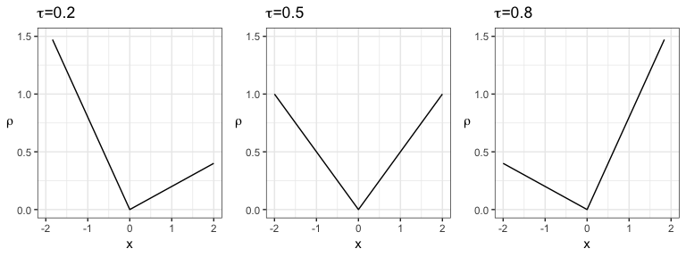

For quantile regression __estimation__, we minimize the sum of scores instead of the sum of squared residuals, as in the usual (mean) linear regression.
