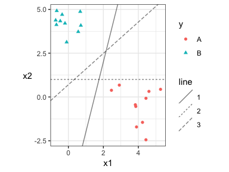
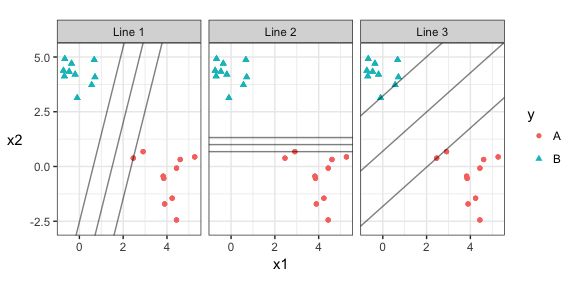
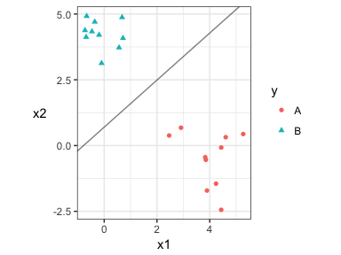
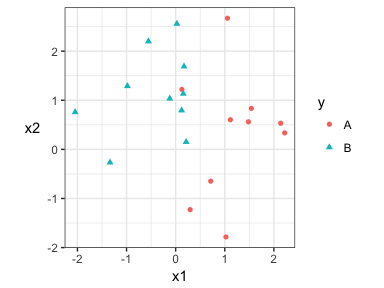
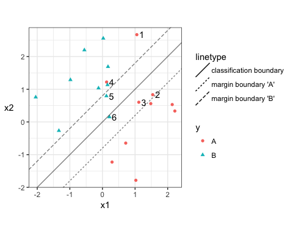
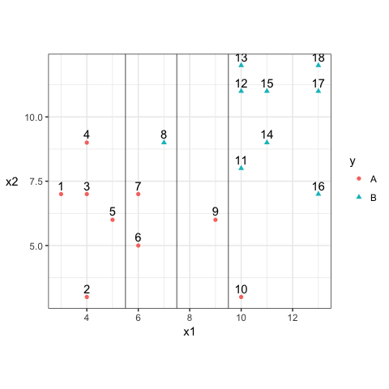

# BAIT 509 Class Meeting 09
Monday, March 26, 2018  

# Overview

- Maximal Margin Classifier, and hyperplanes
- Support Vector Classifiers (SVC)
- Support Vector Machines (SVM)
- Extensions to multiple classes
- SVM's in python
- Feedback on Assignment 1
- Lab: work on Assignment 3

# Announcement

The "participation assessment" is available on Connect. Please submit a link to your github repo (or repos) before the end of class on Wednesday.

# The setup

Today, we'll dicuss a new method for __binary classification__ -- that is, classification when there are two categories. The method is called __Support Vector Machines__. We'll build up to it by considering two special cases:

1. The Maximal Margin Classifier (too restrictive to use in practice)
2. The Support Vector Classifier (linear version of SVM)

We'll demonstrate concepts when there are two predictors, because it's more difficult to visualize in higher dimensions. But concepts generalize.

Let's start by loading some useful R packages to demonstrate concepts.


```r
suppressPackageStartupMessages(library(tidyverse))
knitr::opts_chunk$set(fig.width=6, fig.height=3, fig.align="center")
```


# Maximal Margin Classifier

## Setup

Consider the following two-predictor example. The response can take on one of two categories: "A" or "B". Also consider the three classifiers, where above a line we predict "B", and below, we predict "A":



Each line perfectly classifies the training data -- which one would you prefer, and why?

## The Method

The Maximal Margin Classifier only applies when the two groups can be perfectly separated on the training set by:

- a dividing line (if we have 2 predictors),
- a dividing plane (if we have 3 predictors),
- or in general, we need a __dividing hyperplane__.

We choose the line/hyperplane so that the observations closest to the line/hyperplane are as far away as possible. This minimizes the chance that a new observation will be misclassified. 

We can say this another way. Notice that, for any given line, we can define the "widest slab" before touching an observation. Here are the widest slabs for the above cases:



The Maximal Marginal Classifier _chooses the line whose slab width is maximal_. Half the "slab width" is called the __margin__, so this classifier __maximizes the margin__. There are algorithms to do this maximization.

With this in mind, we can order the above three lines from best to worst: Line 2 is the worst, and Line 3 is the best. 

Notice that there are only three observations that define the slab for Line 3 -- these are called __support vectors__. 

__But:__ a perfect linear classification almost never happens with real data, but this is an important setup before moving on to support vector machines. 

## Making Predictions, and Confidence

We can classify new points as follows:

1. If $(x1,x2)$ lies above the line, predict "B".
2. If $(x1,x2)$ lies below the line, predict "A".



But, we need a way to automate this, since orientation is not always natural with a hyperplane (for example, we have to switch to "left and right" if the dividing line is vertical).

The idea here is to write the equation of the line/hyperplane as
$$ \beta_0 x_1 + \beta_1 x_2 + \beta_3 = 0. $$
We can then classify based on the sign of the left-hand-side of the equation. Note that this can be written in the usual `y=mx+b` format as
$$ x_2 = \left(-\frac{\beta_0}{\beta_1}\right) x_1 + \left(- \frac{\beta_3}{\beta_1}\right), $$
but this is only useful for plotting.

For the above classifier, the line is 
$$ 0.59 x_1 - 0.66 x_2 + 0.46 = 0, $$
and we classify "B" whenever
$$ 0.59 x_1 - 0.66 x_2 + 0.46 < 0, $$
and "A" whenever
$$ 0.59 x_1 - 0.66 x_2 + 0.46 > 0. $$
You can figure out which is which by just trying a point that you know the classification of. 

This equation also gives us a measure of __confidence__ in our classification -- the further the magnitude of the left-hand-side is from 0, the further away from the separating hyperplane it is.

# Support Vector Classifiers

Support Vector Classifiers (or SVC) are more realistic in the sense that they don't require perfect separability of the data. 

Consider now the following data:



A SVC fits a line (or in general, a hyperplane) that "best" separates the data in some way. The idea, as before, is to _choose the line that results in the biggest margin_. The only problem is, there's no such thing as a maximal margin for a given line anymore. Let's work on defining that. 

Here's an example of a line and a margin (not necessarily a "maximal" margin -- just some random margin that I chose). The dividing line is the middle one, so above this line is a "B" prediction. We'll call the upper and lower lines the "margin boundaries".



The idea is to calculate a __total penalty__ associated with each observation with this line-margin combination, like so:

1. Observations that are both correctly classified and outside of the "slab" do not receive any penalty.
2. Observations that are correctly classified, but within the margin, receive a penalty equal to the _proportion of the way through the margin_ they are.
    - This means that observations lying on the classification boundary receive a penalty of 1, because they are entirely one margin width away from its margin boundary.
3. Step (2) can be generalized to observations that are misclassified -- they receive a penalty equal to the number of margin widths they are away from their margin boundary.
    - This means that an "A" that's on B's margin boundary will receive a penalty of 2.
    
The numbered observations in the above plot receive a penalty:

- Penalty between 0 and 1: observations 2,3,5
- Penalty between 1 and 2: observation 6
- Penalty greater than 2: 1 and 4.

Add up the penalties to obtain a total penalty.

If we _choose_ a maximum allowable total penalty, say $C$, then for any line, there's a set of margin widths that result in a penalty less than $C$. The maximal margin for that line is the biggest margin.

Again, the algorithm chooses the line that has the _biggest maximal margin_, for a given total penalty $C$.

Note that, for the above plot, observations 1-6 are called __support vectors__, because they are the only ones to contribute to a penalty. 

# In-class exercises

Consider the following data, decision boundary, and margin boundaries.



1. Construct the decision rule according to this classification boundary. How would you classify a new observation that has $x_1=6$ and $x_2=10$?

> If `x1<7.5`, then "A". Else "B". For the above example, since `x1=6<7.5`, we would classify "A".

2. What size is the margin here?

> The margin width is 2 units. 

3. Which observations receive a penalty? Which observations are the support vectors?

> The observations that receive a penalty are 6,7,8,9,10. These are also the support vectors, by definition.

4. What is the total penalty here?

> The penalty, added in order of observations 6-10, is 0.25+0.25+1.25+1.75+2.25 = 5.75.

5. Can I choose a bigger margin if my total allowable penalty is 6?

> Yes -- increasing the margin will eventually lead to an increase in penalty, which is allowable.

6. Are the data separable? If so, what are the support vectors?

> The data are separable -- as such, we can apply a maximal margin classifier to it. The support vectors would be 4,8,9.

# Support Vector Machines

Quite often, a linear boundary is not useful for classification. Take the below extreme example:


Recall in linear regression, we can fit other shapes besides lines by transforming the predictors, such as adding powers of the predictor to get polynomials.

We can do this to get non-linear decision boundaries on the original predictor space, but it's usually quite computationally expensive. The way to fix the problem is beyond the scope of this course, but the idea is to use __kernel functions__. The kernel function typically has a hyperparameter associated with it. Two of the most popular examples:

1. The polynomial kernel, with hyperparameter = the degree of the polynomial.
2. The radial kernel, which has hyperparameter typically denoted "gamma" (a positive number).
    - Uses nearby training data for classification, where larger values of gamma allow for data to be further.

Note that SVC and Maximum Margin Classification are special cases of SVM. 

# Multi-class Prediction

If there are more than two classes to predict, we can use one of two approaches to do the classification. Suppose there are $K$ categories.

## Approach 1: One-vs-one, or all-pairs

This approach fits an SVM to all pairs of categories. That is:

1. Subset the data to only include two of the $K$ categories.
2. Fit SVM
3. Repeat 1-2 for all possible pairs.

Classification is made using the "popular vote".

## Approach 2: One-vs-all

This approach fits an SVM for each category against "other". That's $K$ SVM's in total. That is:

1. Choose a category $j$. Lump all other categories into one category called "other".
2. Fit SVM
3. Repeat 1-2 for all $K$ choices of $j$.

Remember the measure of "confidence" introduced in 4.3, as the absolute value of the left-hand-side of the equation of the hyperplane? We choose the category that results in the highest confidence score. 

# SVM in python

The scikit-learn documentation for running SVM's in python is available [here](http://scikit-learn.org/stable/modules/svm.html).

In general, the machine learning paradigm in python (at least with scikit-learn, the go-to machine learning library) is to

1. Initialize the method.
2. Fit the model.
3. Query the fit.

You can run classification in python with the `sklearn.svm` bundle of methods. From this bundle, the method `SVC` is useful for SVM's (despite its name), and `LinearSVC` is a special case when the classification boundary is linear (what we've been calling SVC).

Load `SVC` like so:

```
from sklearn import svm
```

Let's use a dataset from the documentation

```
from sklearn.datasets import make_classification
X, y = make_classification(n_features=4, random_state=0)
```

`X` is a matrix of the predictors (as a list of lists), with predictors in the columns, and observations in the rows. `y` is a list of labels/categories, with length equal to the number of rows of `X`. 

Let's use scikit-learn.

1. Initialize the model.

We'll store the initialization in a variable called `my_model`. We can use the defaul of SVC, like so:

```
my_model = SVC()
```

Or I could have specified hyperparameters here. For example,  specify `SVC(C=10, kernel="rbf")` for a penalty of $C=10$, using the radial basis function kernel (you can use the `gamma` argument to control gamma, too). More details are in the documentation.

2. Fit the model.

This is typically done in scikit-learn by appending `.fit(X, y)` to your initialized model, where `X` and `y` are as above.

```
my_model.fit(X, y)
```

Recall that, with python, the above code modifies the object `my_model`. 

3. Query the fit

Now we can go ahead and do things with the fit, such as make predictions:

```
my_model.predict(X_new)
```

If `X_new` is like `X` (possibly with a different number of rows), then predictions will be made on this new data set. Note that this above code _does not_ modify `my_model`, like appending `.fit` does. 

We can calculate accuracy:

```
my_model.score(X_new, y_new)
```

where `y_new` is like `y`, but for `X_new`. 

We can also calculate the distance to the decision boundary by appending `.decision_function`:

```
my_model.decision_function(X)
```

# Feedback on Assignment 1

Hard to say which exercise needs most attention -- perhaps Exercise 4, then perhaps Exercise 2.

# Lab

Use the remainder of the class time to complete Assignment 3. 
