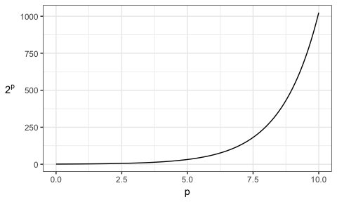

# Overview

- Feedback on Assignment 2
- Overview of Assignment 3 solutions
- Overview of some feature and model selection techniques
- Lab component: work on your final projects


```r
suppressPackageStartupMessages(library(tidyverse))
```


# Alternative measures of model goodness

The coefficient of determination ($R^2$) can be calculated whenever it makes sense to calculate MSE. It equals:
$$ R^2 = 1 - \frac{\text{MSE of your model}}{\text{MSE of the model that always predicts } \bar{y}}. $$ This number lies between 0 and 1, where a 1 represents perfect prediction on the set that you're computing $R^2$ with.

When we have a distributional assumption (such as Gaussian errors), we can calculate the likelihood -- or more often, the negative log likelihood ($\ell$). If the density/mass function of $y_i$ is $f_i$, and we have $n$ observations, then the negative log likelihood is
$$ \ell = -\sum_{i=1}^{n} \log(f_i(y_i)). $$

# Feature and model selection: setup

For supervised learning, we seek a model that gives us the lowest generalization error as possible. This involves two aspects:

1. Reduce the irreducible error.
    - This involves __feature engineering__ and __feature selection__: finding and choosing predictors that give us as much information about the response as we can get.
2. Reduce the reducible error (= bias & variance)
    - This involves __modelling__ and __tuning__, so that we can extract the information that the predictors hold about the response as best as we can. The better our model, the lower our reducible error is.
    - This has been the main focus of BAIT 509, via models such as loess, kNN, random forests, SVM, etc.

Recall for (2) that we avoid overfitting by tuning (choosing hyperparameters, such as $k$ in kNN) to optimize generalization error. We estimate generalization error either using the validation set approach, cross validation, or the out-of-bag approach for bagging. 

The same thing applies to choosing features/predictors and choosing models, although model selection has a few extra components that should be considered.

# Model selection

The question here is, what supervised learning method should you use? There are a few things you should consider.

1. Quantitative choice

Suppose you've gone ahead and fit your best random forest model, kNN model, linear regression model, etc. Which do you choose? You should have estimated the generalization error for each model (for example, on a validation set) -- choose the one that gives the lowest error.

You might find that some models have roughly the same error. In this case, feel free to use all of these to make predictions. You can either look at all predictions, or take an average of the model outputs (called __model averaging__). Considering all models may be quite informative, though -- for example, if all models are suggesting the same thing for a new case, then the decision is clearer than if they all say different things. 

2. Qualitative choice

Sometimes, after exploring the data, it makes sense to add model assumptions. For example, perhaps your response looks linear in your predictors. If so, it may be reasonable to assume linearity, and fit a linear regression model. 

Note that adding assumptions like this generally reduce the variance in your model fit -- but is prone to bias if the assumption is far from the truth. As usual, adding assumptions is about reducing the bias-variance tradeoff.

3. Human choice (interpretability)

Sometimes it's helpful for a model to be interpretable. For example, the slopes in linear regression hold meaning; odds ratios in logistic regression hold meaning; nodes in a decision tree have meaning. If this is the case, then interpretability should also be considered.

# Feature (predictor) selection

Recall that, when tuning a supervised learning method (such as choosing $k$ in kNN), we can make the training error arbitrarily small -- but this results in overfitting the training data. The same thing applies to the number of predictors you add. 

Here's an example. I'll generate 100 observations of 1 response and 99 predictor variables totally randomly, fit a linear regression model with all the predictors, and calculate MSE:


```r
set.seed(38)
dat <- as.data.frame(matrix(rnorm(100*100), ncol=100))
names(dat)[1] <- "y"
fit <- lm(y~., data=dat)
mean((dat$y - predict(fit))^2)
```

```
## [1] 7.519591e-29
```

The MSE is 0 (up to computational precision) -- the response is perfectly predicted on the training set. 

If we consider the number of predictors as a tuning parameter, then we can optimize this by estimating generalization error, as usual. 

But there are approaches that we can use that's specific to feature selection, that we'll discuss next. You are not expected to apply these for your project! This is just for your information.

## Specialized metrics for feature selection

_You are not required to use this method for your project._

Using these specialized metrics, we don't need to bother holding out data to estimate generalization error: they have a penalty built into them based on the number of predictors that the model uses.  

- The __adjusted $R^2$__ is a modified version of $R^2$.
- The __AIC__ and __BIC__ are modified versions of the negative log likelihood.

There are others, like Mallows' $C_p$. 

Optimize these on the training data -- they're designed to (try to) prevent overfitting. 

But, with $p$ predictors, we'd have $2^p$ models to calculate these statistics for! That's _a lot_ of models when $p$ is not even all that large. Here's how the number of models grows as $p$ increases:



For 10 predictors, that's 1000 models. For 20 predictors, that's over 1,000,000.


## Greedy Selection

_You are not required to use this method for your project._

Instead of fitting all models, we can take a "greedy approach". This may not result in the optimal model, but the hope is that we get close. One of three methods are typically used:

1. Forward Selection

The idea here is to start with the null model: no predictors. Then, add one predictor at a time, each time choosing the best one in terms of generalization error OR in terms of one of the specialized measures discussed above. Sometimes, a hypothesis test is used to determine whether the addition of the predictor is significant enough.

2. Backward Selection

The idea here is to start with the full model: all predictors. Then, gradually remove predictors that are either insignificant according to a hypothesis test, or that gives the greatest reduction in one of the specialized measures discussed above. 

3. Stepwise Selection

The idea here is to combine forward and backward selection. Instead of only adding or only removing predictors, we can consider either at each iteration: adding or removing. 

## Regularization

_You are not required to use this method for your project._

When training a model, we can write the training procedure as the optimization of a __loss function__. For example, in regression, we want to minimize the sum of squared errors. 

__Regularization__ adds a penalty directly to this loss function, that grows as the number of predictors grows. This is in contrast to the specialized measures (like adjusted $R^2$) that adds the penalty to the error term _after_ the model is fit. There are different types of regularization, but typically those that involve an L1 regularizer are used in feature selection. 

# Lab

Use the remaining class time to work on your group projects. 
